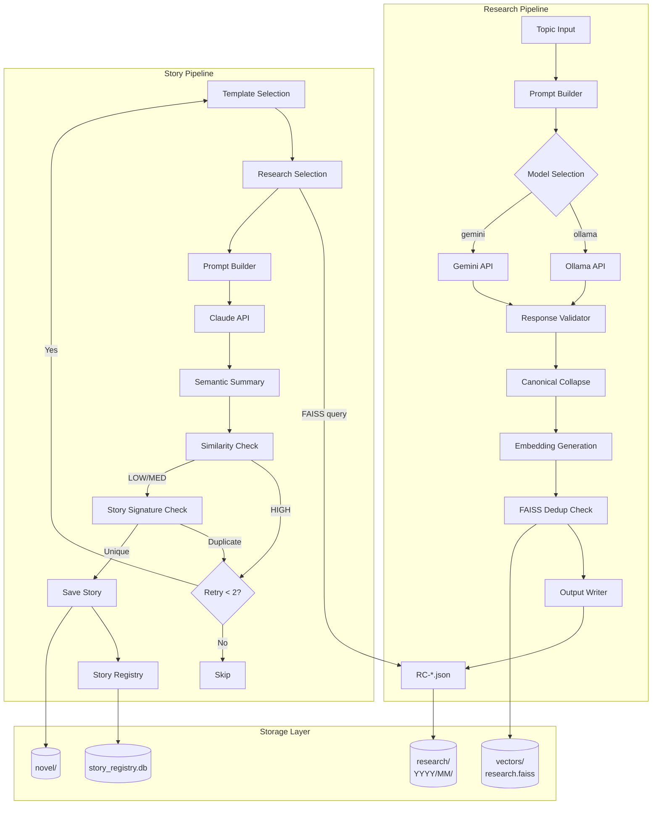

# Implementation Audit Report

**생성일:** 2026-01-14
**버전:** v1.4.0 <!-- x-release-please-version -->
**작성자:** Claude Code (Implementation Audit Agent)

---

## 1. Executive Summary

Horror Story Generator는 세 가지 주요 파이프라인으로 구성된 콘텐츠 생성 시스템이다:

1. **Research Pipeline**: Ollama/Gemini 기반 공포 연구 카드 생성
2. **Story Pipeline**: Claude API 기반 공포 소설 생성
3. **Trigger API**: 비동기 작업 관리 (FastAPI)

### 핵심 발견사항

| 항목 | 상태 | 비고 |
|------|------|------|
| 데이터 구조 정의 | ✅ 완료 | JSON Schema + Pydantic + dataclass 병용 |
| RAG 구현 | ✅ 완료 | FAISS + Ollama embeddings |
| 중복 제거 | ✅ 완료 | 3단계 (Research/Story Semantic/Story Signature) |
| 문서화 | ⚠️ 부분 불일치 | 실제 저장 경로 일부 불일치 |

---

## 2. Repository Map

### 2.1 Entry Points

| Entry Point | 파일 | 용도 |
|-------------|------|------|
| Story CLI | `main.py` | 스토리 생성 CLI |
| Research CLI | `src/research/executor/cli.py` | 리서치 카드 생성 CLI |
| Trigger API | `src/api/main.py` | FastAPI 서버 |

### 2.2 Core Modules

```
src/
├── api/                           # FastAPI API 계층
│   ├── routers/                   # 라우터 (jobs, story, research, dedup)
│   ├── schemas/                   # Pydantic 스키마
│   └── services/                  # 비즈니스 로직 서비스
├── dedup/                         # 중복 제거 시스템
│   ├── research/                  # Research dedup (FAISS + embedding)
│   │   ├── embedder.py           # Ollama 임베딩 생성
│   │   ├── index.py              # FAISS 인덱스 관리
│   │   └── dedup.py              # 유사도 검사 로직
│   └── similarity.py             # Story semantic 유사도
├── infra/                         # 인프라 유틸리티
│   ├── data_paths.py             # 중앙화된 경로 관리
│   ├── job_manager.py            # 작업 관리
│   ├── job_monitor.py            # 작업 모니터링
│   └── research_context/          # 리서치 컨텍스트 선택/포맷
│       ├── selector.py           # canonical affinity 매칭
│       ├── repository.py         # 카드 로딩/검색
│       ├── formatter.py          # 프롬프트 포맷팅
│       └── policy.py             # DedupLevel 정책
├── registry/                      # 영구 저장소 (SQLite)
│   ├── story_registry.py         # 스토리 레지스트리
│   ├── research_registry.py      # 리서치 레지스트리
│   └── seed_registry.py          # 시드 레지스트리
├── research/                      # 리서치 생성기
│   ├── executor/                  # 실행 엔진
│   │   ├── executor.py           # LLM 호출
│   │   ├── cli.py                # CLI 진입점
│   │   ├── validator.py          # 응답 검증
│   │   ├── output_writer.py      # 파일 저장
│   │   ├── canonical_collapse.py # canonical_affinity → canonical_core
│   │   └── model_provider.py     # Ollama/Gemini 추상화
│   └── integration/               # 스토리 생성 통합
│       ├── loader.py             # 카드 로딩
│       └── selector.py           # 카드 선택
└── story/                         # 스토리 생성기
    ├── generator.py              # 메인 생성 로직
    ├── api_client.py             # Claude API 클라이언트
    ├── prompt_builder.py         # 프롬프트 빌더
    ├── template_loader.py        # 템플릿 로더
    ├── model_provider.py         # Ollama/Claude 추상화
    └── dedup/                     # Story-level dedup
        ├── story_signature.py    # 시그니처 계산
        └── story_dedup_check.py  # 중복 검사
```

### 2.3 Storage Paths

**실제 저장 구조 (검증됨):**

```
data/
├── novel/                         # 스토리 출력 (v1.3.1+)
│   └── YYYY/MM/                   # 날짜 기반 하위 디렉토리
├── research/
│   ├── 2026/01/                   # RC-*.json (레거시 + 현재)
│   ├── cards/                     # (미사용, 문서에만 존재)
│   ├── vectors/
│   │   ├── research.faiss        # FAISS 인덱스
│   │   └── metadata.json         # card_id <-> vector 매핑
│   ├── logs/
│   └── registry.sqlite           # (미확인 - 실제로는 미사용 가능)
├── seeds/
│   └── seed_registry.sqlite
└── story_registry.db              # SQLite 스토리 레지스트리

jobs/                              # 작업 메타데이터 JSON
logs/                              # 실행 로그
generated_stories/                 # 레거시 스토리 출력 (deprecated)
```

**⚠️ 불일치 발견:**
- `data_paths.py`는 `data/research/cards/` 사용 예정이나 실제로는 `data/research/YYYY/MM/`에 저장
- `find_all_research_cards()`가 레거시 경로를 올바르게 처리함

---

## 3. Implemented Data Structures

### 3.1 Research Card (Canonical Type A)

**위치:** `data/research/YYYY/MM/RC-*.json`
**스키마 버전:** `1.0`

```json
{
  "card_id": "RC-20260114-005317",
  "version": "1.0",
  "metadata": {
    "created_at": "2026-01-14T00:53:17.273913",
    "model": "gemma-3-27b-it",
    "generation_time_ms": 12788,
    "prompt_tokens_est": 331,
    "output_tokens_est": 325,
    "status": "complete",
    "provider": "gemini"
  },
  "input": {
    "topic": "Japanese Neapolitan-style Urban Legend",
    "tags": ["Creepypasta", "RulesHorror"]
  },
  "output": {
    "title": "Neapolitan Urban Legend: The Vanishing Pedestrians",
    "summary": "...",
    "key_concepts": ["phantom vehicle", "vanishing individuals", ...],
    "horror_applications": ["...", "...", "..."],
    "canonical_affinity": {
      "setting": ["urban", "liminal", "infrastructure", "domestic_space"],
      "primary_fear": ["loss_of_autonomy", "annihilation", "identity_erasure", "isolation"],
      "antagonist": ["system", "unknown", "collective"],
      "mechanism": ["erosion", "impersonation", "surveillance", "exploitation"]
    },
    "raw_response": "```json\n{...}\n```"
  },
  "validation": {
    "has_title": true,
    "has_summary": true,
    "has_concepts": true,
    "has_applications": true,
    "canonical_parsed": true,
    "quality_score": "good",
    "parse_error": null
  },
  "canonical_core": {
    "setting_archetype": "liminal",
    "primary_fear": "annihilation",
    "antagonist_archetype": "system",
    "threat_mechanism": "erosion",
    "twist_family": "inevitability"
  },
  "dedup": {
    "similarity_score": 0.0,
    "level": "LOW",
    "nearest_card_id": null
  }
}
```

#### Field Reference

| Field | Type | Required | Description |
|-------|------|----------|-------------|
| `card_id` | string | ✅ | `RC-YYYYMMDD-HHMMSS` 형식 |
| `version` | string | ✅ | 스키마 버전 (현재 `1.0`) |
| `metadata.created_at` | ISO datetime | ✅ | 생성 타임스탬프 |
| `metadata.model` | string | ✅ | 사용된 LLM 모델명 |
| `metadata.status` | enum | ✅ | `complete`, `error` |
| `metadata.provider` | string | ✅ | `ollama`, `gemini` |
| `input.topic` | string | ✅ | 연구 주제 |
| `input.tags` | string[] | ✅ | 사용자 태그 |
| `output.title` | string | ✅ | 생성된 제목 |
| `output.summary` | string | ✅ | 요약 |
| `output.key_concepts` | string[] | ✅ | 핵심 개념 (보통 5개) |
| `output.horror_applications` | string[] | ✅ | 공포 스토리 활용 아이디어 |
| `output.canonical_affinity` | object | ✅ | 다중값 canonical 분류 |
| `output.raw_response` | string | ✅ | LLM 원본 응답 |
| `validation.*` | various | ✅ | 검증 결과 |
| `canonical_core` | object | ⚠️ | 단일값으로 정규화된 canonical key |
| `dedup` | object | ⚠️ | 중복 검사 결과 |

**증거:** `src/research/executor/output_writer.py:65-148`

---

### 3.2 Canonical Core Schema

**위치:** `schema/canonical_key.schema.json`

```json
{
  "$schema": "https://json-schema.org/draft/2020-12/schema",
  "title": "Canonical Key",
  "type": "object",
  "properties": {
    "setting_archetype": {
      "type": "string",
      "enum": ["apartment", "hospital", "rural", "domestic_space",
               "digital", "liminal", "infrastructure", "body", "abstract"]
    },
    "primary_fear": {
      "type": "string",
      "enum": ["loss_of_autonomy", "identity_erasure", "social_displacement",
               "contamination", "isolation", "annihilation"]
    },
    "antagonist_archetype": {
      "type": "string",
      "enum": ["ghost", "system", "technology", "body", "collective", "unknown"]
    },
    "threat_mechanism": {
      "type": "string",
      "enum": ["surveillance", "possession", "debt", "infection",
               "impersonation", "confinement", "erosion", "exploitation"]
    },
    "twist_family": {
      "type": "string",
      "enum": ["revelation", "inevitability", "inversion",
               "circularity", "self_is_monster", "ambiguity"]
    }
  },
  "required": ["setting_archetype", "primary_fear", "antagonist_archetype",
               "threat_mechanism", "twist_family"],
  "additionalProperties": false
}
```

**증거:** `schema/canonical_key.schema.json:1-83`

---

### 3.3 Story Registry Record

**위치:** `data/story_registry.db` (SQLite)
**스키마 버전:** `1.1.0`

```sql
CREATE TABLE stories (
    id TEXT PRIMARY KEY,
    created_at TEXT NOT NULL,
    title TEXT,
    template_id TEXT,
    template_name TEXT,
    semantic_summary TEXT NOT NULL,
    similarity_method TEXT NOT NULL,
    accepted INTEGER NOT NULL,
    decision_reason TEXT NOT NULL,
    source_run_id TEXT,
    story_signature TEXT,           -- v1.1.0
    canonical_core_json TEXT,       -- v1.1.0
    research_used_json TEXT         -- v1.1.0
);
```

#### Python Dataclass

```python
@dataclass
class StoryRegistryRecord:
    id: str
    created_at: str
    title: Optional[str]
    template_id: Optional[str]
    template_name: Optional[str]
    semantic_summary: str
    similarity_method: str
    accepted: bool
    decision_reason: str
    source_run_id: Optional[str] = None
    story_signature: Optional[str] = None        # v1.1.0
    canonical_core_json: Optional[str] = None    # v1.1.0
    research_used_json: Optional[str] = None     # v1.1.0
```

**증거:** `src/registry/story_registry.py:36-52, 172-191`

---

### 3.4 Research Registry Record

**위치:** `data/research/registry.sqlite` (SQLite)

```sql
CREATE TABLE research_cards (
    card_id TEXT PRIMARY KEY,
    topic TEXT NOT NULL,
    created_at TIMESTAMP DEFAULT CURRENT_TIMESTAMP,
    file_path TEXT,
    embedding_indexed INTEGER DEFAULT 0,
    dedup_score REAL DEFAULT 0.0,
    dedup_signal TEXT DEFAULT 'LOW',
    status TEXT DEFAULT 'pending'
);
```

#### Python Dataclass

```python
@dataclass
class ResearchCardRecord:
    card_id: str
    topic: str
    created_at: datetime
    file_path: Optional[str] = None
    embedding_indexed: bool = False
    dedup_score: float = 0.0
    dedup_signal: str = "LOW"
    status: str = "pending"
```

**증거:** `src/registry/research_registry.py:30-41, 63-78`

---

### 3.5 Job Record

**위치:** `jobs/{job_id}.json`

```json
{
  "job_id": "abc-123-def",
  "type": "story_generation",
  "status": "running",
  "pid": 12345,
  "log_path": "logs/story_abc-123-def.log",
  "artifacts": [],
  "created_at": "2026-01-12T10:00:00",
  "started_at": "2026-01-12T10:00:01",
  "webhook_url": null,
  "max_stories": 5
}
```

**증거:** `src/infra/job_manager.py:34-60`

---

## 4. Persistence & Storage

### 4.1 파일 기반 저장

| 데이터 | 경로 | 형식 | 네이밍 규칙 |
|--------|------|------|-------------|
| Research Cards | `data/research/YYYY/MM/` | JSON | `RC-YYYYMMDD-HHMMSS.json` |
| Stories | `data/novel/` (또는 `generated_stories/`) | Markdown | `horror_story_YYYYMMDD_HHMMSS.md` |
| Jobs | `jobs/` | JSON | `{job_id}.json` |
| FAISS Index | `data/research/vectors/` | Binary | `research.faiss` |
| Vector Metadata | `data/research/vectors/` | JSON | `metadata.json` |

### 4.2 SQLite 저장

| 데이터베이스 | 경로 | 용도 |
|--------------|------|------|
| Story Registry | `data/story_registry.db` | 스토리 중복 제거 |
| Research Registry | `data/research/registry.sqlite` | 리서치 카드 메타데이터 |
| Seed Registry | `data/seeds/seed_registry.sqlite` | 스토리 시드 |

---

## 5. RAG Implementation Status

### 5.1 구현 상태: ✅ 완료

시스템은 FAISS 기반 벡터 검색을 통한 RAG를 구현함.

### 5.2 Embedding 생성

**모듈:** `src/dedup/research/embedder.py`
**모델:** `nomic-embed-text` (Ollama)
**차원:** 768 (자동 감지)

```python
# 임베딩 텍스트 구성
text = f"Topic: {topic}\nTitle: {title}\nSummary: {summary}\n" + \
       f"Concepts: {concepts}\nApplications: {applications}"
```

**증거:** `src/dedup/research/embedder.py:311-352`

### 5.3 Indexing

**모듈:** `src/dedup/research/index.py`
**인덱스 타입:** `faiss.IndexFlatIP` (Inner Product, L2 정규화)
**영속화:** `data/research/vectors/research.faiss`, `metadata.json`

### 5.4 Retrieval

**모듈:** `src/infra/research_context/selector.py`

**선택 알고리즘:**
1. 사용 가능한 카드 로드 (HIGH dedup 제외)
2. 각 카드에 대해 템플릿 `canonical_core`와 affinity 점수 계산
3. 가중치 적용 (primary_fear: 1.5, antagonist: 1.2, mechanism: 1.3, setting: 1.0)
4. 임계값 이상의 상위 K개 반환

**증거:** `src/infra/research_context/selector.py:77-218`

### 5.5 Context Injection

선택된 리서치 카드는 시스템 프롬프트에 삽입됨:

```python
research_context = build_research_context(research_selection)
system_prompt = build_system_prompt(skeleton=skeleton, research_context=research_context)
```

**증거:** `src/story/generator.py:438-458`

---

## 6. End-to-End Dataflow



---

## 7. Documentation Parity Matrix

| 문서 | 구현 일치 | 불일치 내용 | 증거 |
|------|-----------|-------------|------|
| `docs/core/ARCHITECTURE.md` | ⚠️ 부분 일치 | 경로 불일치 (`cards/` vs `YYYY/MM/`) | `data_paths.py:102-112` |
| `docs/technical/canonical_enum.md` | ✅ 일치 | - | `schema/canonical_key.schema.json` |
| `schema/canonical_key.schema.json` | ✅ 일치 | - | `canonical_collapse.py:36-59` |
| `docs/core/README.md` | ✅ 일치 | - | CLI 테스트 검증됨 |
| `docs/core/API.md` | ✅ 일치 | - | Swagger 검증됨 |

### 7.1 발견된 불일치

#### 경로 구조 불일치

**문서 (`data_paths.py` 주석):**
```
data/research/cards/YYYY/MM/RC-*.json
```

**실제 구현:**
```
data/research/YYYY/MM/RC-*.json
```

**영향:**
- `find_all_research_cards()` 함수가 레거시 경로를 올바르게 처리하므로 기능상 문제 없음
- 문서 업데이트 필요

---

## 8. Missing/Outdated Docs & Proposed Additions

### 8.1 누락된 문서

| 문서 | 우선순위 | 내용 |
|------|----------|------|
| `docs/data-model/canonical-data.md` | HIGH | 정규 데이터 구조 명세 |
| `docs/architecture/dataflow.md` | MEDIUM | E2E 데이터플로우 다이어그램 |

### 8.2 업데이트 필요 문서

| 문서 | 이슈 |
|------|------|
| `src/infra/data_paths.py` | 주석의 경로 구조가 실제와 불일치 |
| `docs/core/ARCHITECTURE.md` | Storage 섹션 경로 수정 필요 |

---

## 9. Next Hardening Steps (권장사항)

> 이 섹션은 향후 개선 권장사항이며, 본 감사에서 구현하지 않음.

1. **경로 정규화**
   - `data/research/cards/` 디렉토리를 실제로 사용하거나 문서를 수정
   - 레거시 경로 마이그레이션 스크립트 작성 고려

2. **스키마 검증 강화**
   - JSON Schema 런타임 검증 추가
   - Pydantic 모델과 JSON Schema 동기화 자동화

3. **RAG 성능 모니터링**
   - 임베딩 품질 메트릭 추가
   - FAISS 인덱스 성능 벤치마크

4. **문서 자동 생성**
   - Pydantic 모델에서 OpenAPI 스키마 자동 추출
   - 데이터 구조 변경 시 문서 자동 업데이트

---

## Appendix A: Search Commands Used

```bash
# Schema definitions
rg -n "BaseModel|dataclass|TypedDict|canonical" --type py

# Serialization
rg -n "json\.dump|json\.load|yaml|pickle|sqlite" --type py

# File writes
rg -n "open\(|Path.*write|\.write_text" --type py

# Data directories
find . -maxdepth 4 -type d | grep -E "(data|storage|output)"
```

---

## Appendix B: Key File References

| 컴포넌트 | 파일 | 핵심 라인 |
|----------|------|-----------|
| Research Card Schema | `src/research/executor/output_writer.py` | 65-148 |
| Canonical Collapse | `src/research/executor/canonical_collapse.py` | 104-149 |
| FAISS Index | `src/dedup/research/index.py` | 25-294 |
| Embedder | `src/dedup/research/embedder.py` | 35-291 |
| Research Selector | `src/infra/research_context/selector.py` | 77-218 |
| Story Registry | `src/registry/story_registry.py` | 36-52, 172-191 |
| Story Generator | `src/story/generator.py` | 370-578 |
| Data Paths | `src/infra/data_paths.py` | 전체 |

---

**End of Audit Report**
