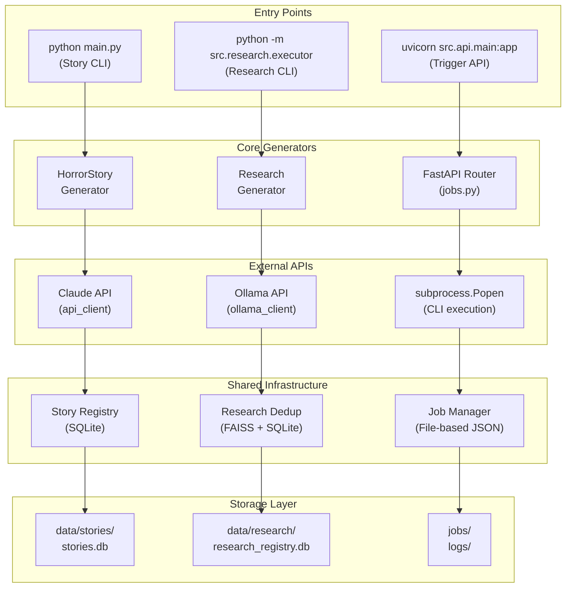
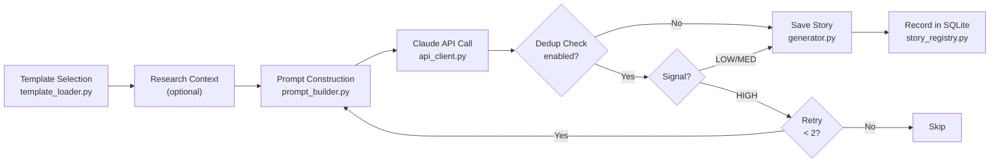
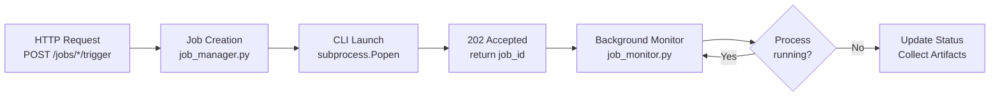
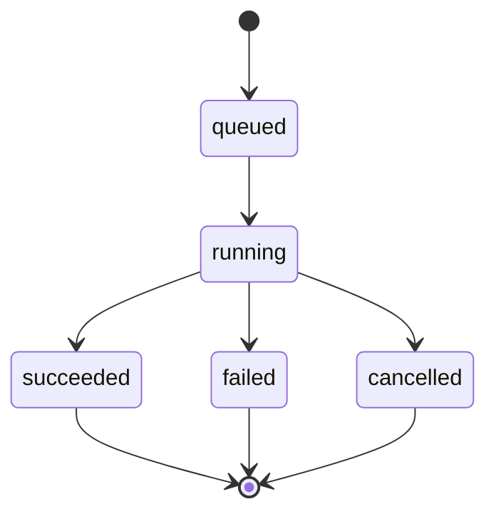

# System Architecture

**Status:** Active
**Baseline:** Post–STEP 4-C canonical baseline

---

## Overview

The Horror Story Generator is a multi-pipeline content generation system with three execution paths:

1. **Story Generation** - Claude API-based horror story creation
2. **Research Generation** - Ollama-based research card creation
3. **Trigger API** - Non-blocking job execution via HTTP

All pipelines share common infrastructure for deduplication, storage, and monitoring.

---

## High-Level Architecture



---

## Pipeline 1: Story Generation

### Flow



### Key Modules

| Module | File | Responsibility |
|--------|------|----------------|
| Generator | `src/story/generator.py` | Orchestrates generation pipeline |
| Template Loader | `src/story/template_loader.py` | Loads/selects templates |
| Prompt Builder | `src/story/prompt_builder.py` | Constructs LLM prompts |
| API Client | `src/story/api_client.py` | Claude API communication |
| Story Registry | `src/registry/story_registry.py` | Deduplication database |

### Deduplication Control

The dedup system uses **canonical fingerprinting**:

```python
canonical_core = {
    "setting": "apartment",
    "primary_fear": "social_displacement",
    "antagonist": "system",
    "mechanism": "surveillance",
    "twist": "inevitability"
}
```

**Signal Calculation:**
- Compare new story's canonical_core against all stored stories
- Count matching dimensions (0-5)
- Score = matches / 5

**Decision Logic:**
| Signal | Score | Action |
|--------|-------|--------|
| LOW | < 0.3 | Accept |
| MEDIUM | 0.3-0.6 | Accept (logged) |
| HIGH | > 0.6 | Regenerate (max 2x), then skip |

---

## Pipeline 2: Research Generation

### Flow


### Research Card Schema

```json
{
  "card_id": "RC-20260112-143052",
  "version": "1.0",
  "metadata": {
    "created_at": "2026-01-12T14:30:52",
    "model": "qwen3:30b",
    "status": "complete"
  },
  "output": {
    "title": "...",
    "summary": "...",
    "key_concepts": ["..."],
    "horror_applications": ["..."],
    "canonical_affinity": {
      "setting": ["urban", "apartment"],
      "primary_fear": ["isolation"],
      "antagonist": ["system"],
      "mechanism": ["surveillance"]
    }
  },
  "validation": {
    "has_title": true,
    "has_summary": true,
    "has_concepts": true,
    "has_applications": true,
    "canonical_parsed": true,
    "quality_score": "good"
  }
}
```

### Key Modules

| Module | File | Responsibility |
|--------|------|----------------|
| CLI | `src/research/executor/cli.py` | Command-line interface |
| Executor | `src/research/executor/executor.py` | Ollama API + generation |
| Validator | `src/research/executor/validator.py` | Output parsing/validation |
| Output Writer | `src/research/executor/output_writer.py` | File persistence |
| Embedder | `src/dedup/research/embedder.py` | Ollama embedding (nomic-embed-text) |
| FAISS Index | `src/dedup/research/index.py` | Vector storage |
| Dedup | `src/dedup/research/dedup.py` | Similarity checking |

---

## Pipeline 3: Trigger API

### Design Principle

> **CLI = Source of Truth**

The API does not contain business logic. It triggers CLI commands via subprocess and monitors their execution.

### Flow



### Job Lifecycle



### Key Modules

| Module | File | Responsibility |
|--------|------|----------------|
| Router | `src/api/routers/jobs.py` | HTTP endpoints |
| Schemas | `src/api/schemas/jobs.py` | Pydantic models |
| Job Manager | `src/infra/job_manager.py` | Job CRUD operations |
| Job Monitor | `src/infra/job_monitor.py` | PID polling, status updates |

### Job Storage

Jobs are stored as JSON files:

```
jobs/
└── {job_id}.json

{
  "job_id": "abc-123-def",
  "type": "story_generation",
  "status": "running",
  "pid": 12345,
  "log_path": "logs/story_abc-123-def.log",
  "artifacts": [],
  "created_at": "2026-01-12T10:00:00",
  "started_at": "2026-01-12T10:00:01"
}
```

---

## Foundation Assets

### Knowledge Units (52 total)

Located in `assets/knowledge_units/`

| Category | Count | Description |
|----------|-------|-------------|
| horror_concept | 14 | Theoretical foundations |
| horror_theme | 15 | Specific motifs/scenarios |
| social_fear | 17 | Real-world systemic threats |
| writing_technique | 6 | Craft techniques |

### Templates (15 total)

Located in `assets/templates/`

Each template defines:
- `canonical_core` - Unique identity fingerprint
- `required_ku_categories` - Compatible KU types
- `story_skeleton` - 3-act structure
- `variation_axes` - Allowed variations

**Template Distribution:**
- Systemic horror: 6 templates
- Domestic horror: 3 templates
- Medical horror: 2 templates
- Digital horror: 2 templates
- Other: 2 templates

### Canonical Dimensions

| Dimension | Values |
|-----------|--------|
| `setting_archetype` | apartment, hospital, rural, domestic_space, digital, liminal, infrastructure, body, abstract |
| `primary_fear` | loss_of_autonomy, identity_erasure, social_displacement, contamination, isolation, annihilation |
| `antagonist_archetype` | ghost, system, technology, body, collective, unknown |
| `threat_mechanism` | surveillance, possession, debt, infection, impersonation, confinement, erosion, exploitation |
| `twist_family` | revelation, inevitability, inversion, circularity, self_is_monster, ambiguity |

---

## Data Storage

### SQLite Databases

| Database | Location | Purpose |
|----------|----------|---------|
| Story Registry | `data/stories.db` | Story dedup fingerprints |
| Research Registry | `data/research_registry.db` | Research card metadata |

### File Storage

| Directory | Contents |
|-----------|----------|
| `data/stories/` | Generated story JSON files |
| `data/research/` | Research card JSON files |
| `generated_stories/` | Legacy story output (Markdown) |
| `jobs/` | Job metadata JSON files |
| `logs/` | Execution logs |

---

## External Dependencies

| Service | Purpose | Required |
|---------|---------|----------|
| Claude API | Story generation | Yes |
| Ollama | Research generation | Optional |

### Local-First Architecture

The system is designed to run locally without external services beyond Claude API:
- SQLite for persistence (no external database)
- FAISS-cpu for vector search (no GPU required)
- File-based job storage (no message queue)

---

## Graceful Shutdown

The story generator supports graceful shutdown via SIGINT/SIGTERM:

1. Signal received → `shutdown_requested = True`
2. Current generation completes
3. Results saved
4. Final statistics logged
5. Clean exit (code 0)

---

## Design Decisions

Key architectural decisions are documented in `docs/technical/decision_log.md`:

- **D-001**: CLI as source of truth for business logic
- **D-002**: Hybrid KU selection (category + canonical matching)
- **D-003**: Assisted manual generation (not fully automated)
- **D-004**: HIGH-only blocking policy for deduplication
- **D-005**: File-based job storage for simplicity

---

## Assumptions and Uncertainties

### Assumptions

- Single-user/single-instance deployment
- Claude API rate limits are sufficient for intended usage
- Ollama runs on same machine as the application

### Uncertainties

- [Uncertain] Optimal KU count per template (currently 2-5 recommended)
- [Uncertain] Long-term scalability of file-based job storage
- [Uncertain] FAISS index performance beyond 10,000 research cards

---

**Note:** All documentation reflects the current `src/` package structure (Post STEP 4-B).
