# System Architecture

**Status:** Active
**Version:** v1.5.0 <!-- x-release-please-version -->

---

## Overview

The Horror Story Generator is a multi-pipeline content generation system with three execution paths:

1. **Story Generation** - Claude API-based horror story creation
2. **Research Generation** - Ollama-based research card creation
3. **Trigger API** - Non-blocking job execution via HTTP

All pipelines share common infrastructure for deduplication, storage, and monitoring.

---

## High-Level Architecture

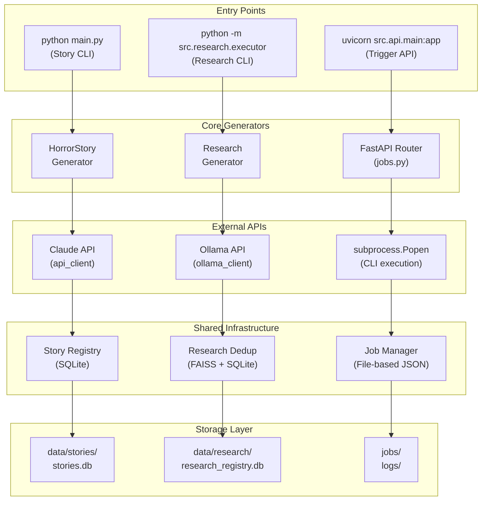

---

## Pipeline 1: Story Generation

### Flow

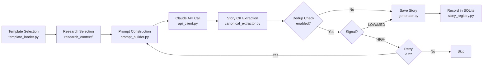

### Topic-Based Generation (v1.2.0+)

When a topic is provided, the generator uses a different flow:

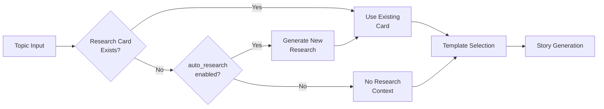

**Topic Matching:**
1. Search cards by topic keyword (exact match > partial match > title match)
2. If no match and `auto_research=True`, generate new research via `run_research_pipeline()`
3. Use matched/generated research card for story context

**API Entry Point:** `POST /story/generate` (blocking) or `POST /jobs/story/trigger` (non-blocking)

### Research Auto-Injection (Default: ON)

Story generation automatically selects and injects matching research cards:

1. **Selection**: Uses `select_research_for_template()` from `src/infra/research_context/`
2. **Affinity Scoring**: Matches template's `canonical_core` against research `canonical_affinity`
3. **Dedup Filter**: Excludes HIGH-dedup cards by default (configurable)
4. **Injection**: Adds research context to system prompt

**Configuration:**
| Env Variable | Default | Description |
|--------------|---------|-------------|
| `AUTO_INJECT_RESEARCH` | `true` | Enable/disable auto-injection |
| `RESEARCH_INJECT_TOP_K` | `1` | Number of cards to inject |
| `RESEARCH_INJECT_REQUIRE` | `false` | Fail if no research matches |
| `RESEARCH_INJECT_EXCLUDE_DUP_LEVEL` | `HIGH` | Exclude HIGH/MEDIUM duplicates |

**Traceability**: Story metadata includes `research_used` field listing injected card IDs.

### Story-Level Deduplication

Story-level dedup prevents structurally duplicated stories even with cosmetic variations.

#### Signature-Based Dedup (v1.0+)

**Story Signature:**
```
canonical_core + research_used → SHA256 hash
```

**Detection Flow:**
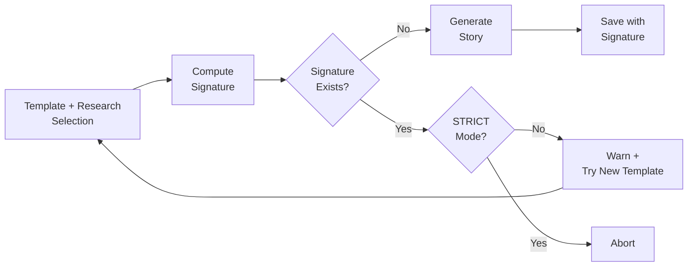

#### Semantic Embedding Dedup (v1.4.0+)

In addition to signature-based dedup, story content can be checked for semantic similarity using embeddings.

**Architecture:**
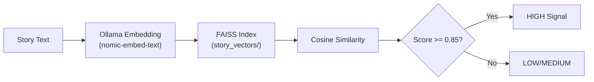

**Hybrid Scoring:**
```
hybrid_score = (canonical_score × 0.3) + (semantic_score × 0.7)
```

| Component | Weight | Description |
|-----------|--------|-------------|
| Canonical | 30% | Exact signature match (0 or 1) |
| Semantic | 70% | Cosine similarity (0.0 to 1.0) |

**Duplicate Detection:**
- Exact signature match → Always HIGH
- Hybrid score ≥ 0.85 → HIGH (semantic duplicate)
- Hybrid score 0.70-0.85 → MEDIUM
- Hybrid score < 0.70 → LOW

**Configuration:**
| Env Variable | Default | Description |
|--------------|---------|-------------|
| `ENABLE_STORY_DEDUP` | `true` | Enable signature-based dedup |
| `STORY_DEDUP_STRICT` | `false` | Abort generation on duplicate |
| `ENABLE_STORY_SEMANTIC_DEDUP` | `true` | Enable semantic embedding dedup |
| `STORY_SEMANTIC_THRESHOLD_HIGH` | `0.85` | HIGH similarity threshold |
| `STORY_HYBRID_CANONICAL_WEIGHT` | `0.3` | Canonical weight in hybrid score |
| `STORY_HYBRID_SEMANTIC_WEIGHT` | `0.7` | Semantic weight in hybrid score |

**Story Metadata:**
```json
{
  "story_signature": "abc123...",
  "story_dedup_result": "unique",
  "story_dedup_reason": "unique",
  "semantic_similarity_score": 0.45,
  "hybrid_dedup_score": 0.315,
  "nearest_story_id": "story-20260112-143052"
}
```

**Key Modules:**
| Module | File | Purpose |
|--------|------|---------|
| Story Embedder | `src/dedup/story/embedder.py` | Extract text and generate embeddings |
| Story FAISS Index | `src/dedup/story/index.py` | Vector storage for stories |
| Semantic Dedup | `src/dedup/story/semantic_dedup.py` | Similarity checking |
| Hybrid Dedup | `src/dedup/story/hybrid_dedup.py` | Combined scoring |

**Storage:**
```
data/story_vectors/
├── story.faiss          # FAISS index for story embeddings
└── metadata.json        # story_id ↔ vector mapping
```

### Story Canonical Key Extraction

After story generation, the system extracts canonical dimensions from the **actual story text** to compare against the template's predefined `canonical_core`.

**Extraction Flow:**
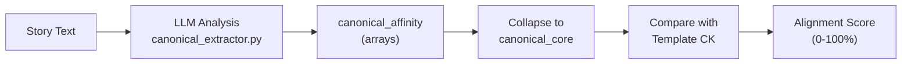

**Purpose:**
- Validate that generated content matches intended structure
- Track divergence between template intent and actual output
- Provide quality signals for future improvements

**Configuration:**
| Env Variable | Default | Description |
|--------------|---------|-------------|
| `ENABLE_STORY_CK_EXTRACTION` | `true` | Enable/disable extraction |
| `STORY_CK_MODEL` | (none) | Override model for extraction |

**Alignment Score Calculation:**
```
alignment_score = matched_dimensions / 5 × 100%
```

| Score | Interpretation |
|-------|----------------|
| 100% | Perfect alignment |
| 80% | 4/5 dimensions match |
| 60% | 3/5 dimensions match |
| <40% | Significant divergence |

**Story Metadata:**
```json
{
  "story_canonical_extraction": {
    "canonical_core": {
      "setting_archetype": "apartment",
      "primary_fear": "social_displacement",
      "antagonist_archetype": "collective",
      "threat_mechanism": "surveillance",
      "twist_family": "inevitability"
    },
    "template_comparison": {
      "match_score": 0.8,
      "matches": ["setting_archetype", "primary_fear", "threat_mechanism", "twist_family"],
      "divergences": [{"dimension": "antagonist_archetype", "template": "system", "story": "collective"}]
    }
  }
}
```

### Story Canonical Key Extraction & Enforcement

After story generation, the system extracts canonical dimensions from the **actual story text** to compare against the template's predefined `canonical_core`, then applies enforcement policy.

**Extraction & Enforcement Flow:**
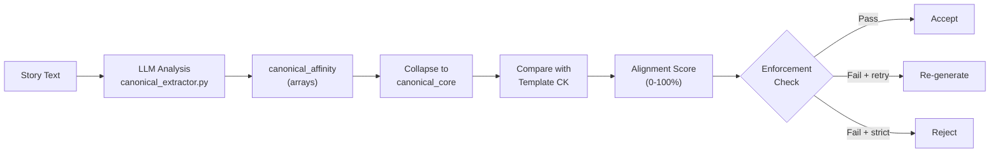

**Purpose:**
- Validate that generated content matches intended structure
- Track divergence between template intent and actual output
- Enforce alignment constraints via configurable policy
- Provide quality signals for future improvements

**Extraction Configuration:**
| Env Variable | Default | Description |
|--------------|---------|-------------|
| `ENABLE_STORY_CK_EXTRACTION` | `true` | Enable/disable extraction |
| `STORY_CK_MODEL` | (none) | Override model for extraction |

**Enforcement Configuration:**
| Env Variable | Default | Description |
|--------------|---------|-------------|
| `STORY_CK_ENFORCEMENT` | `warn` | Policy: none/warn/retry/strict |
| `STORY_CK_MIN_ALIGNMENT` | `0.6` | Minimum alignment score (0.0-1.0) |

**Enforcement Policies:**
| Policy | Action on Failure |
|--------|-------------------|
| `none` | Always accept (disabled) |
| `warn` | Log warning, accept anyway (default) |
| `retry` | Re-attempt with different template |
| `strict` | Reject story entirely |

**Alignment Score Calculation:**
```
alignment_score = matched_dimensions / 5 × 100%
```

| Score | Interpretation |
|-------|----------------|
| 100% | Perfect alignment |
| 80% | 4/5 dimensions match |
| 60% | 3/5 dimensions match (default threshold) |
| <40% | Significant divergence |

**Story Metadata:**
```json
{
  "story_canonical_extraction": {
    "canonical_core": {
      "setting_archetype": "apartment",
      "primary_fear": "social_displacement",
      "antagonist_archetype": "collective",
      "threat_mechanism": "surveillance",
      "twist_family": "inevitability"
    },
    "template_comparison": {
      "match_score": 0.8,
      "matches": ["setting_archetype", "primary_fear", "threat_mechanism", "twist_family"],
      "divergences": [{"dimension": "antagonist_archetype", "template": "system", "story": "collective"}]
    },
    "enforcement": {
      "passed": true,
      "action": "accept",
      "reason": "Alignment 80% meets threshold 60%",
      "policy": "warn"
    }
  }
}
```

### Key Modules

| Module | File | Responsibility |
|--------|------|----------------|
| Generator | `src/story/generator.py` | Orchestrates generation pipeline (`generate_story`, `generate_with_topic`) |
| Template Loader | `src/story/template_loader.py` | Loads/selects templates |
| Prompt Builder | `src/story/prompt_builder.py` | Constructs LLM prompts |
| API Client | `src/story/api_client.py` | Claude API communication |
| **Canonical Extractor** | `src/story/canonical_extractor.py` | Story CK extraction & alignment scoring |
| Story Registry | `src/registry/story_registry.py` | Deduplication database |
| Research Context | `src/infra/research_context/` | Unified research selection & injection |
| Story Dedup | `src/story/dedup/` | Story-level signature-based deduplication |
| Research Executor | `src/research/executor/executor.py` | `run_research_pipeline()` for auto-research |

### Deduplication Control

The dedup system uses **canonical fingerprinting**:

```python
canonical_core = {
    "setting": "apartment",
    "primary_fear": "social_displacement",
    "antagonist": "system",
    "mechanism": "surveillance",
    "twist": "inevitability"
}
```

**Signal Calculation:**
- Compare new story's canonical_core against all stored stories
- Count matching dimensions (0-5)
- Score = matches / 5

**Decision Logic:**
| Signal | Score | Action |
|--------|-------|--------|
| LOW | < 0.3 | Accept |
| MEDIUM | 0.3-0.6 | Accept (logged) |
| HIGH | > 0.6 | Regenerate (max 2x), then skip |

---

## Pipeline 2: Research Generation

### Flow

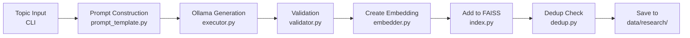

### Research Card Schema

```json
{
  "card_id": "RC-20260112-143052",
  "version": "1.0",
  "metadata": {
    "created_at": "2026-01-12T14:30:52",
    "model": "qwen3:30b",
    "status": "complete"
  },
  "output": {
    "title": "...",
    "summary": "...",
    "key_concepts": ["..."],
    "horror_applications": ["..."],
    "canonical_affinity": {
      "setting": ["urban", "apartment"],
      "primary_fear": ["isolation"],
      "antagonist": ["system"],
      "mechanism": ["surveillance"]
    }
  },
  "canonical_core": {
    "setting_archetype": "apartment",
    "primary_fear": "isolation",
    "antagonist_archetype": "system",
    "threat_mechanism": "surveillance",
    "twist_family": "inevitability"
  },
  "dedup": {
    "level": "LOW",
    "similarity_score": 0.45,
    "most_similar_card": "RC-20260110-091234"
  },
  "validation": {
    "has_title": true,
    "has_summary": true,
    "has_concepts": true,
    "has_applications": true,
    "canonical_parsed": true,
    "quality_score": "good"
  }
}
```

### Key Modules

| Module | File | Responsibility |
|--------|------|----------------|
| CLI | `src/research/executor/cli.py` | Command-line interface |
| Executor | `src/research/executor/executor.py` | Ollama API + generation |
| Validator | `src/research/executor/validator.py` | Output parsing/validation |
| Output Writer | `src/research/executor/output_writer.py` | File persistence |
| Embedder | `src/dedup/research/embedder.py` | Ollama embedding (nomic-embed-text) |
| FAISS Index | `src/dedup/research/index.py` | Vector storage |
| Dedup | `src/dedup/research/dedup.py` | Similarity checking |
| Canonical Collapse | `src/research/executor/canonical_collapse.py` | canonical_affinity → canonical_core |
| Vector Backend | `src/research/integration/vector_backend_hooks.py` | Unified vector operations |

### Vector Backend Hooks (v1.4.0+)

Centralized vector operations for research card semantic search and clustering.

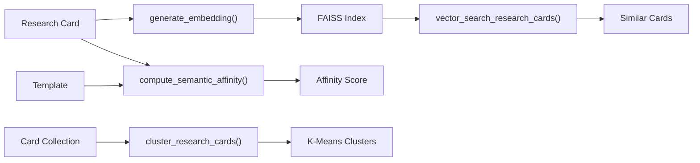

**Functions:**
| Function | Description |
|----------|-------------|
| `init_vector_backend()` | Initialize Ollama embedder and FAISS index |
| `generate_embedding(text)` | Generate embedding via nomic-embed-text |
| `vector_search_research_cards(embedding, top_k)` | Search similar cards in FAISS |
| `index_research_card(card_id, content, metadata)` | Add card to FAISS index |
| `compute_semantic_affinity(template_canonical, research_content)` | Cosine similarity between template and research |
| `cluster_research_cards(cards, n_clusters)` | K-means++ clustering on embeddings |

**Configuration:**
| Env Variable | Default | Description |
|--------------|---------|-------------|
| `VECTOR_BACKEND_ENABLED` | `true` | Enable vector backend features |

### Canonical Core Normalization

Research cards include `canonical_core` - a normalized, schema-valid representation collapsed from `canonical_affinity`:

```
canonical_affinity (arrays)     →     canonical_core (single values)
────────────────────────────────────────────────────────────────────
setting: ["apartment", "urban"] →     setting_archetype: "apartment"
primary_fear: ["isolation"]     →     primary_fear: "isolation"
antagonist: ["system"]          →     antagonist_archetype: "system"
mechanism: ["surveillance"]     →     threat_mechanism: "surveillance"
(missing twist)                 →     twist_family: "inevitability" (default)
```

**Collapse Rules:**
- First valid value wins (invalid values are filtered)
- Primary fear uses priority ordering (annihilation > identity_erasure > ...)
- Missing dimensions get sensible defaults

---

## Pipeline 3: Trigger API

### Design Principle

> **CLI = Source of Truth**

The API does not contain business logic. It triggers CLI commands via subprocess and monitors their execution.

### Flow

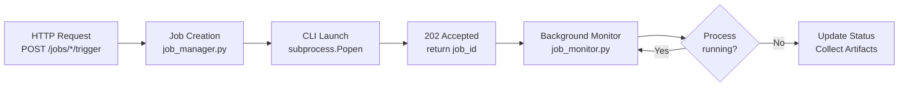

### Job Lifecycle

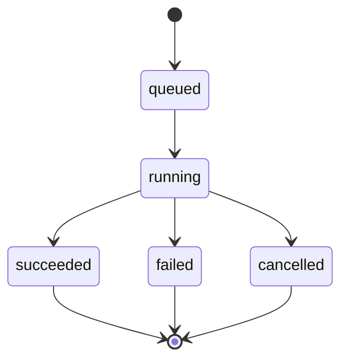

### Key Modules

| Module | File | Responsibility |
|--------|------|----------------|
| Jobs Router | `src/api/routers/jobs.py` | Non-blocking job endpoints |
| Story Router | `src/api/routers/story.py` | Direct story generation/listing |
| Schemas | `src/api/schemas/` | Pydantic models |
| Job Manager | `src/infra/job_manager.py` | Job CRUD operations |
| Job Monitor | `src/infra/job_monitor.py` | PID polling, status updates |

### Job Storage

Jobs are stored as JSON files:

```
jobs/
└── {job_id}.json

{
  "job_id": "abc-123-def",
  "type": "story_generation",
  "status": "running",
  "pid": 12345,
  "log_path": "logs/story_abc-123-def.log",
  "artifacts": [],
  "created_at": "2026-01-12T10:00:00",
  "started_at": "2026-01-12T10:00:01"
}
```

---

## Foundation Assets

### Knowledge Units (52 total)

Located in `assets/knowledge_units/`

| Category | Count | Description |
|----------|-------|-------------|
| horror_concept | 14 | Theoretical foundations |
| horror_theme | 15 | Specific motifs/scenarios |
| social_fear | 17 | Real-world systemic threats |
| writing_technique | 6 | Craft techniques |

### Templates (15 total)

Located in `assets/templates/`

Each template defines:
- `canonical_core` - Unique identity fingerprint
- `required_ku_categories` - Compatible KU types
- `story_skeleton` - 3-act structure
- `variation_axes` - Allowed variations

**Template Distribution:**
- Systemic horror: 6 templates
- Domestic horror: 3 templates
- Medical horror: 2 templates
- Digital horror: 2 templates
- Other: 2 templates

### Canonical Dimensions

| Dimension | Values |
|-----------|--------|
| `setting_archetype` | apartment, hospital, rural, domestic_space, digital, liminal, infrastructure, body, abstract |
| `primary_fear` | loss_of_autonomy, identity_erasure, social_displacement, contamination, isolation, annihilation |
| `antagonist_archetype` | ghost, system, technology, body, collective, unknown |
| `threat_mechanism` | surveillance, possession, debt, infection, impersonation, confinement, erosion, exploitation |
| `twist_family` | revelation, inevitability, inversion, circularity, self_is_monster, ambiguity |

---

## Data Storage

### SQLite Databases

| Database | Location | Purpose |
|----------|----------|---------|
| Story Registry | `data/stories.db` | Story dedup fingerprints |
| Research Registry | `data/research_registry.db` | Research card metadata |

### File Storage

| Directory | Contents |
|-----------|----------|
| `data/novel/` | Generated story files (v1.3.1+, configurable via `NOVEL_OUTPUT_DIR`) |
| `data/research/` | Research card JSON files |
| `jobs/` | Job metadata JSON files (configurable via `JOB_DIR`) |
| `logs/` | Execution logs |

---

## Model Selection

### Overview

The system supports multiple LLM providers through a unified abstraction layer:

| Pipeline | Default Provider | Alternative Providers |
|----------|------------------|----------------------|
| Story Generation | Claude (Anthropic) | Ollama (local) |
| Research Generation | Ollama (local) | Gemini (optional, feature-flagged) |

### Provider Abstraction

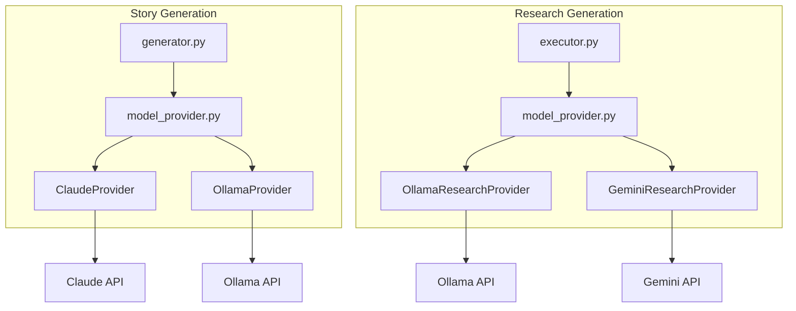

### Model Specification Format

| Format | Provider | Example |
|--------|----------|---------|
| `ollama:{model}` | Ollama | `ollama:llama3`, `ollama:qwen` |
| `gemini` | Gemini | `gemini` (uses GOOGLE_AI_MODEL env) |
| `gemini:{model}` | Gemini | `gemini:gemini-2.5-flash` |
| `{claude-model}` | Anthropic | `claude-sonnet-4-5-20250929` |
| (none) | Default | Story: Claude, Research: Ollama |

### Story Model Selection

**CLI:**
```bash
# Default (Claude Sonnet)
python main.py

# Ollama local models
python main.py --model ollama:llama3
python main.py --model ollama:qwen
```

**API:**
```json
POST /jobs/story/trigger
{
  "max_stories": 5,
  "model": "ollama:llama3"
}
```

**Metadata Recording:**
```json
{
  "model": "claude-sonnet-4-5-20250929",
  "provider": "anthropic"
}
```

### Research Model Selection

**CLI:**
```bash
# Default (Ollama qwen3:30b)
python -m src.research.executor run "topic"

# Different Ollama model
python -m src.research.executor run "topic" --model qwen:14b

# Gemini standard (requires GEMINI_ENABLED=true)
python -m src.research.executor run "topic" --model gemini

# Gemini Deep Research Agent (requires GEMINI_ENABLED=true)
python -m src.research.executor run "topic" --model deep-research
```

**Metadata Recording (Ollama):**
```json
{
  "model": "qwen3:30b",
  "provider": "ollama"
}
```

**Metadata Recording (Deep Research):**
```json
{
  "model": "deep-research-pro-preview-12-2025",
  "provider": "gemini",
  "execution_mode": "deep_research",
  "interaction_id": "<interaction_id>"
}
```

### Gemini API (Research Only)

Gemini is **feature-flagged** and only available for research generation.

**Two Execution Modes:**

| Mode | Model Spec | API | Use Case |
|------|-----------|-----|----------|
| Standard | `gemini` | models.generate_content | Quick research |
| Deep Research | `deep-research` | Interactions API | Comprehensive research |

**Configuration:**
```env
GEMINI_ENABLED=false          # Must be true to use Gemini
GEMINI_API_KEY=your_key       # Required when enabled
GOOGLE_AI_MODEL=deep-research-pro-preview-12-2025  # Default model
```

**API Provider:** Google AI Studio (not Vertex AI)

**Requirements:**
```bash
pip install google-genai
```

**Usage:**
```bash
# Enable Gemini in .env
GEMINI_ENABLED=true
GEMINI_API_KEY=your_api_key

# Run research with Gemini standard
python -m src.research.executor run "Korean horror themes" --model gemini

# Run research with Gemini Deep Research Agent (recommended)
python -m src.research.executor run "Korean horror themes" --model deep-research
```

### Gemini Deep Research Agent

The Deep Research mode uses the Gemini Interactions API with background execution and polling.

**Agent:** `deep-research-pro-preview-12-2025`

**Execution Flow:**
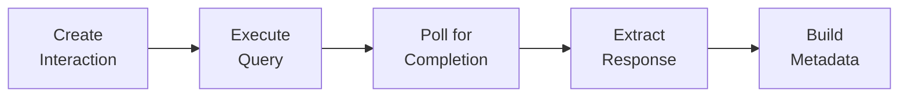

**Features:**
- Asynchronous interaction with polling
- Longer timeout support (up to 10 minutes)
- Detailed research output
- Compatible with existing dedup and canonical pipelines

---

## External Dependencies

| Service | Purpose | Required |
|---------|---------|----------|
| Claude API | Story generation (default) | Yes |
| Ollama | Research generation (default), Story (optional) | Optional |
| Gemini API | Research generation (optional, feature-flagged) | No |

### Local-First Architecture

The system is designed to run locally without external services beyond Claude API:
- SQLite for persistence (no external database)
- FAISS-cpu for vector search (no GPU required)
- File-based job storage (no message queue)

---

## Graceful Shutdown

The story generator supports graceful shutdown via SIGINT/SIGTERM:

1. Signal received → `shutdown_requested = True`
2. Current generation completes
3. Results saved
4. Final statistics logged
5. Clean exit (code 0)

---

## CLI Resource Cleanup (Research Executor)

The research executor CLI automatically unloads Ollama models after execution to release VRAM:

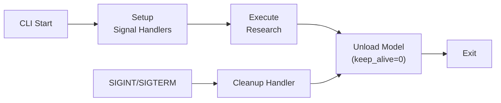

**Cleanup Mechanism:**
1. Model tracked when `execute_research()` starts
2. On success: Model unloaded via `unload_model()`
3. On SIGINT/SIGTERM: Signal handler calls cleanup before exit
4. `atexit` handler as fallback for abnormal exits

**API vs CLI:**
| Context | Resource Manager | Cleanup Trigger |
|---------|------------------|-----------------|
| API Server | `OllamaResourceManager` | FastAPI lifespan events |
| CLI | Signal handlers + atexit | Execution complete or signal |

---

## Registry Backup

The story registry automatically creates a backup before schema migration:

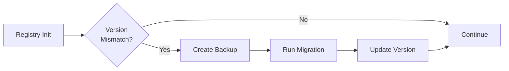

**Backup Details:**
- **Trigger:** Schema version mismatch (e.g., 1.0.0 → 1.1.0)
- **Location:** Same directory as original DB
- **Naming:** `{db}.backup.{version}.{timestamp}.db`
- **Method:** `shutil.copy2` (preserves metadata)

**Example:**
```
data/story_registry.backup.1.0.0.20260112_130012.db
```

**See also:** [Registry Backup Guide](../technical/REGISTRY_BACKUP_GUIDE.md)

---

## Unified Research Context Module

Located at `src/infra/research_context/`, this module provides a single source of truth for research card selection and injection, used by both CLI and API.

### Module Structure

| File | Exports | Purpose |
|------|---------|---------|
| `policy.py` | `DedupLevel`, `is_usable_card`, `get_dedup_level` | Dedup level rules and card usability |
| `repository.py` | `load_usable_research_cards`, `get_card_by_id`, `search_cards_by_topic`, `get_best_card_for_topic` | Card loading with dedup filtering and topic search |
| `selector.py` | `ResearchSelection`, `select_research_for_template` | Canonical affinity matching |
| `formatter.py` | `build_research_context`, `format_research_for_prompt`, `format_research_for_metadata` | Prompt formatting and traceability |

### Dedup Level Policy

| Level | Similarity Score | Default Behavior |
|-------|------------------|------------------|
| LOW | < 0.70 | Usable (unique content) |
| MEDIUM | 0.70-0.85 | Usable (some overlap) |
| HIGH | ≥ 0.85 | **Excluded** (likely duplicate) |

### Selection Algorithm

1. Load all usable cards (excludes HIGH dedup by default)
2. For each card, compute affinity score against template's `canonical_core`
3. Weight dimensions: primary_fear (0.3), setting (0.25), antagonist (0.25), mechanism (0.2)
4. Return top-K cards with scores above threshold

### Traceability

Story metadata includes:
```json
{
  "research_used": ["RC-20260112-143052"],
  "research_injection_mode": "auto",
  "research_selection_score": 0.85,
  "research_selection_reason": "Matched 1/21 usable cards"
}
```

---

## Design Decisions

Key architectural decisions are documented in `docs/technical/decision_log.md`:

- **D-001**: CLI as source of truth for business logic
- **D-002**: Hybrid KU selection (category + canonical matching)
- **D-003**: Assisted manual generation (not fully automated)
- **D-004**: HIGH-only blocking policy for deduplication
- **D-005**: File-based job storage for simplicity
- **D-006**: Unified research context module (`src/infra/research_context/`) for CLI/API consistency
- **D-007**: Research auto-injection ON by default with traceability metadata
- **D-008**: Story-level dedup using signature (canonical_core + research_used → SHA256)
- **D-009**: Story dedup WARN by default, STRICT mode optional for abort

---

## Assumptions and Uncertainties

### Assumptions

- Single-user/single-instance deployment
- Claude API rate limits are sufficient for intended usage
- Ollama runs on same machine as the application

### Uncertainties

- [Uncertain] Optimal KU count per template (currently 2-5 recommended)
- [Uncertain] Long-term scalability of file-based job storage
- [Uncertain] FAISS index performance beyond 10,000 research cards

---

**Note:** All documentation reflects v1.2.0 with model selection, Gemini Deep Research integration, and complete deduplication pipeline.
