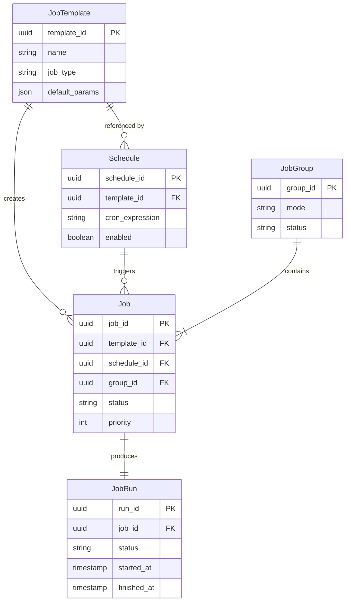

# Job Scheduler Entity Relationships

> **Status:** DRAFT
> **Version:** 0.1.0
> **Last Updated:** 2026-01-18

---

## Overview

This document defines the relationships between Job Scheduler entities. It covers cardinality, ownership semantics, creation triggers, and lifecycle dependencies. These relationships form the foundation for API contract design and database schema decisions.

---

## Entity Relationship Diagram

### High-Level Overview (Mermaid)



### ASCII Diagram

```
┌─────────────────┐
│   JobTemplate   │
│  (Definition)   │
└────────┬────────┘
         │ 1:N (creates)
         │
         ├──────────────────────────────┐
         │                              │
         ▼                              ▼
┌─────────────────┐            ┌─────────────────┐
│    Schedule     │            │      Job        │
│   (Temporal)    │────────────│  (Execution)    │
└─────────────────┘  1:N       └────────┬────────┘
                  (triggers)            │
                                        │ 1:1
                                        ▼
                               ┌─────────────────┐
                               │    JobRun       │
                               │   (History)     │
                               └─────────────────┘

┌─────────────────┐
│    JobGroup     │
│   (Grouping)    │
└────────┬────────┘
         │ 1:N (contains)
         ▼
┌─────────────────┐
│      Job        │
│  (Members)      │
└─────────────────┘
```

---

## Relationship Details

### 1. JobTemplate → Job

| Aspect | Description |
|--------|-------------|
| **Cardinality** | One-to-Many (1:N) |
| **Direction** | JobTemplate is the parent, Job is the child |
| **Optionality** | Job.template_id is NULLABLE (ad-hoc jobs) |
| **Ownership** | Non-owning reference (soft reference) |
| **Cascade Delete** | NO - Jobs persist when template archived |

#### Creation Trigger

Jobs referencing a template are created when:
1. **Manual trigger**: User explicitly requests job creation from template
2. **Schedule trigger**: A Schedule's cron expression fires
3. **API call**: Direct API call specifying template_id

#### Lifecycle Dependency

```
JobTemplate ARCHIVED → Existing Jobs: Unaffected
                     → New Jobs: Cannot be created from this template
                     → Active Schedules: Should be disabled (warning)
```

---

### 2. JobTemplate → Schedule

| Aspect | Description |
|--------|-------------|
| **Cardinality** | One-to-Many (1:N) |
| **Direction** | JobTemplate is referenced, Schedule is the referencer |
| **Optionality** | Schedule.template_id is REQUIRED |
| **Ownership** | Non-owning reference |
| **Cascade Delete** | NO - Schedules become invalid, not deleted |

#### Relationship Semantics

- A Schedule MUST reference exactly one JobTemplate
- A JobTemplate MAY be referenced by zero or more Schedules
- Multiple Schedules can use the same template with different timing/overrides

#### Example

```
JobTemplate: "daily-research"
├── Schedule: "morning-run" (cron: 0 9 * * *)
├── Schedule: "evening-run" (cron: 0 21 * * *)
└── Schedule: "weekend-deep" (cron: 0 10 * * SAT, param_overrides: {depth: "deep"})
```

---

### 3. Schedule → Job

| Aspect | Description |
|--------|-------------|
| **Cardinality** | One-to-Many (1:N) |
| **Direction** | Schedule triggers, Job is triggered |
| **Optionality** | Job.schedule_id is NULLABLE (manual jobs) |
| **Ownership** | Non-owning reference (audit trail only) |
| **Cascade Delete** | NO - Jobs persist for historical audit |

#### Creation Trigger

A Schedule creates a Job when:
1. **Cron fires**: The cron expression matches current time
2. **Catch-up mode**: System recovery after downtime (configurable)
3. **Manual force-trigger**: Admin forces schedule execution

#### Trigger Decision Flow

```
Schedule.cron_expression matches NOW?
├── NO → Do nothing
└── YES → Schedule.enabled?
          ├── NO → Do nothing (log skip)
          └── YES → Template exists and ACTIVE?
                    ├── NO → Log error, optionally disable schedule
                    └── YES → Create Job with:
                              - template_id from Schedule
                              - schedule_id = this Schedule
                              - params = merge(template.default_params, schedule.param_overrides)
                              - priority = schedule.priority OR default
```

---

### 4. Job → JobRun

| Aspect | Description |
|--------|-------------|
| **Cardinality** | One-to-One (1:1) |
| **Direction** | Job produces JobRun |
| **Optionality** | JobRun.job_id is REQUIRED |
| **Ownership** | JobRun is owned by Job |
| **Cascade Delete** | CONFIGURABLE - depends on retention policy |

#### Why 1:1, Not 1:N?

We chose 1:1 over 1:N (retry model) for clarity:
- Each Job represents ONE execution attempt
- Retries create NEW Jobs (with `retry_of` reference)
- Simpler state machine, clearer audit trail

#### Alternative Considered

```
# Rejected: 1:N model with retries as JobRuns
Job
├── JobRun (attempt 1, FAILED)
├── JobRun (attempt 2, FAILED)
└── JobRun (attempt 3, COMPLETED)

# Accepted: 1:1 model with retry chain
Job1 → JobRun1 (FAILED), retry_of: null
Job2 → JobRun2 (FAILED), retry_of: Job1
Job3 → JobRun3 (COMPLETED), retry_of: Job2
```

#### Creation Trigger

JobRun is created when:
1. **Job dispatched**: Worker picks up Job from queue
2. **Execution starts**: First line of actual work begins

```
Job.status = QUEUED
        ↓ (worker claims job)
Job.status = RUNNING + JobRun created
        ↓ (execution completes)
JobRun.status = COMPLETED | FAILED | SKIPPED
```

> Note: DISPATCHED is an internal transition state, not externally visible.

---

### 5. JobGroup → Job

| Aspect | Description |
|--------|-------------|
| **Cardinality** | One-to-Many (1:N) |
| **Direction** | JobGroup contains Jobs |
| **Optionality** | Job.group_id is NULLABLE (ungrouped jobs) |
| **Ownership** | Loose ownership (coordination, not lifecycle) |
| **Cascade Delete** | NO - Jobs can exist without group |

#### Ordering Within Group

Jobs within a group maintain explicit ordering via `position` field:

```
JobGroup (mode: sequential)
├── Job (position: 1) → Executes first
├── Job (position: 2) → Waits for position 1
└── Job (position: 3) → Waits for position 2

JobGroup (mode: parallel)
├── Job (position: 1) ┐
├── Job (position: 2) ├→ All execute concurrently
└── Job (position: 3) ┘
```

#### Group Status Derivation

Group status is derived from member Job and JobRun statuses:

```
All Jobs QUEUED             → Group QUEUED
Any Job RUNNING             → Group RUNNING
All Jobs reach terminal     → Group terminal (see below)

Terminal derivation (based on JobRun results):
- All JobRuns COMPLETED     → Group COMPLETED
- Any JobRun FAILED         → Group PARTIAL
- All Jobs CANCELLED        → Group CANCELLED
```

---

## Ownership Summary Table

| Relationship | Owner | Owned | Cascade Delete? |
|--------------|-------|-------|-----------------|
| JobTemplate → Schedule | Neither | Neither | No |
| JobTemplate → Job | Neither | Neither | No |
| Schedule → Job | Neither | Neither | No |
| Job → JobRun | Job | JobRun | Configurable |
| JobGroup → Job | JobGroup (loose) | Job | No |

---

## Reference Integrity Rules

### Hard References (Required)

| Entity | Field | Constraint |
|--------|-------|------------|
| Schedule | template_id | MUST exist, MUST be ACTIVE |
| JobRun | job_id | MUST exist |

### Soft References (Optional)

| Entity | Field | Constraint |
|--------|-------|------------|
| Job | template_id | MAY be null (ad-hoc) |
| Job | schedule_id | MAY be null (manual) |
| Job | group_id | MAY be null (ungrouped) |

### Snapshot References

Some references are snapshots at creation time (denormalized for audit):

| Entity | Field | Source | Purpose |
|--------|-------|--------|---------|
| JobRun | template_id | Job.template_id | Audit trail |
| JobRun | params_snapshot | Job.params | Reproduce execution |

---

## Creation Flow Diagrams

### Flow 1: Schedule-Triggered Job

```
┌─────────┐    cron fires    ┌──────────┐
│ Schedule │ ───────────────► │  Check   │
└─────────┘                   │ Enabled? │
                              └────┬─────┘
                                   │ yes
                              ┌────▼─────┐
                              │  Lookup  │
                              │ Template │
                              └────┬─────┘
                                   │ found
                              ┌────▼─────┐
                              │  Create  │
                              │   Job    │
                              └────┬─────┘
                                   │
                              ┌────▼─────┐
                              │  Enqueue │
                              │ (QUEUED) │
                              └──────────┘
```

### Flow 2: Manual Job from Template

```
┌──────────┐   POST /jobs    ┌──────────┐
│   User   │ ───────────────► │ Validate │
└──────────┘                  │ Template │
                              └────┬─────┘
                                   │ valid
                              ┌────▼─────┐
                              │  Merge   │
                              │  Params  │
                              └────┬─────┘
                                   │
                              ┌────▼─────┐
                              │  Create  │
                              │   Job    │
                              └────┬─────┘
                                   │
                              ┌────▼─────┐
                              │  Enqueue │
                              │ (QUEUED) │
                              └──────────┘
```

### Flow 3: Job Execution

```
┌──────────┐   poll queue    ┌──────────┐
│  Worker  │ ───────────────► │  Claim   │
└──────────┘                  │   Job    │
                              └────┬─────┘
                                   │
                              ┌────▼─────┐
                              │ DISPATCH │
                              │ Job.stat │
                              └────┬─────┘
                                   │
                              ┌────▼─────┐
                              │  Create  │
                              │  JobRun  │
                              └────┬─────┘
                                   │
                              ┌────▼─────┐
                              │ Execute  │
                              │   Work   │
                              └────┬─────┘
                                   │
                              ┌────▼─────┐
                              │ Finalize │
                              │ Both Ent │
                              └──────────┘
```

---

## Cross-Reference Matrix

Shows which entities reference which:

|                | JobTemplate | Schedule | Job | JobRun | JobGroup |
|----------------|:-----------:|:--------:|:---:|:------:|:--------:|
| **JobTemplate**| -           | -        | -   | -      | -        |
| **Schedule**   | ✓ required  | -        | -   | -      | -        |
| **Job**        | ○ optional  | ○ optional| -  | -      | ○ optional|
| **JobRun**     | ✓ snapshot  | -        | ✓ required | - | -   |
| **JobGroup**   | -           | -        | -   | -      | -        |

Legend:
- ✓ required = Foreign key, must exist
- ○ optional = Nullable foreign key
- ✓ snapshot = Denormalized copy for audit

---

## Glossary

| Term | Definition |
|------|------------|
| **Hard Reference** | Non-nullable FK, target must exist |
| **Soft Reference** | Nullable FK, target may not exist |
| **Snapshot Reference** | Copied value at creation time, immutable |
| **Cascade Delete** | Deleting parent automatically deletes children |
| **Loose Ownership** | Logical grouping without lifecycle dependency |
| **Derived Status** | Status computed from related entity states |

