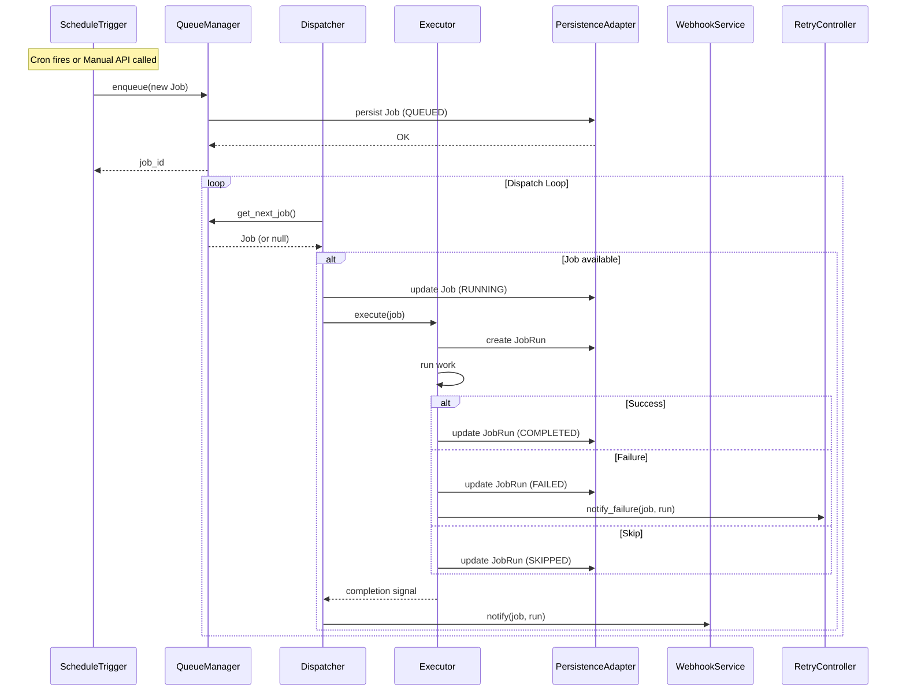
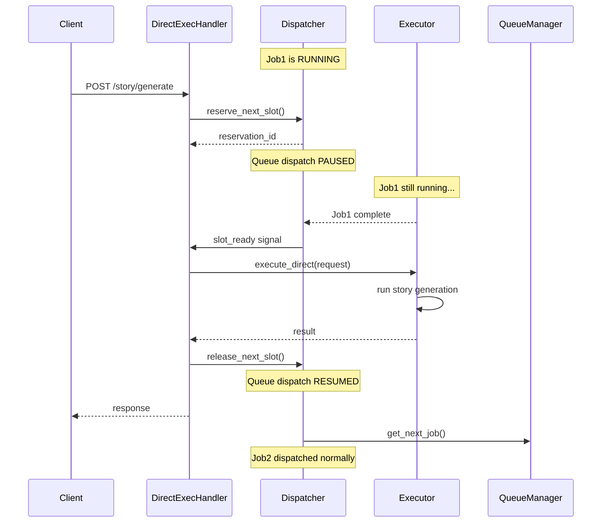
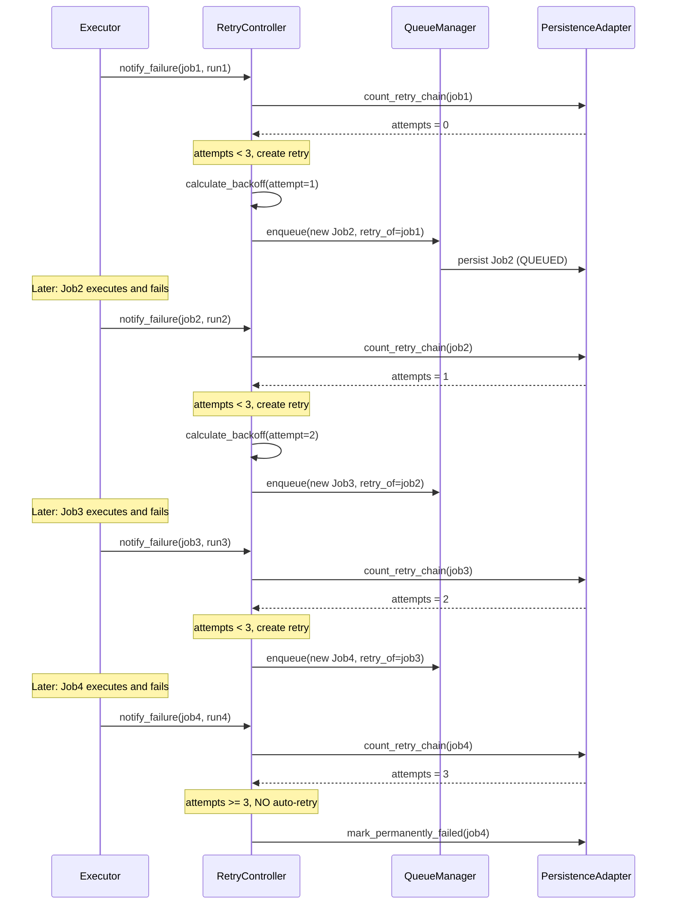
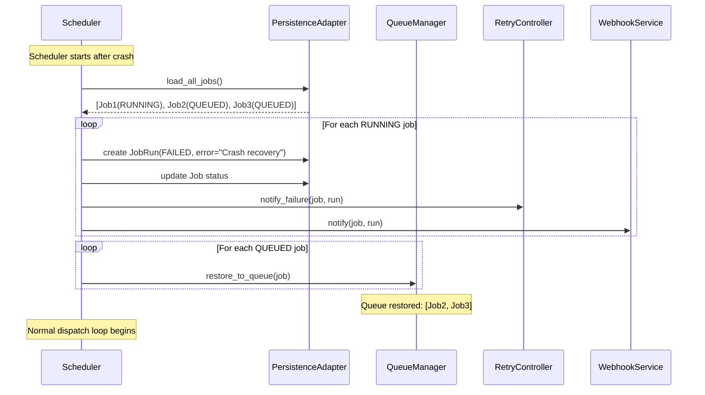
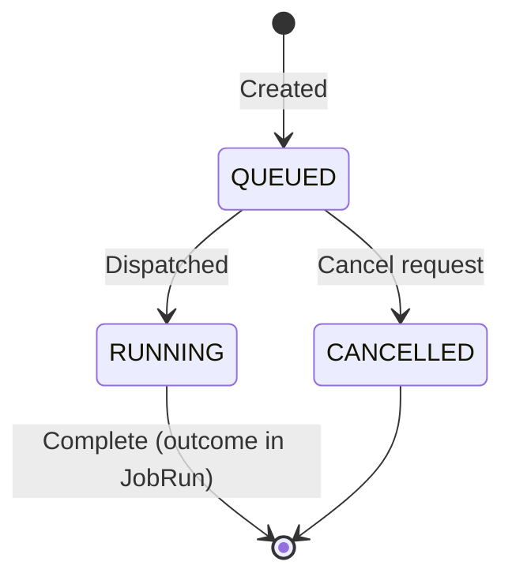
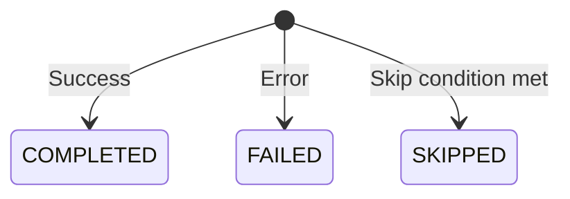

# Job Scheduler Execution Flow

> **Status:** FINAL (Phase 5 Complete)
> **Document Version:** 1.0.0
> **Application Version:** 1.5.0 (managed by release-please)
> **Last Updated:** 2026-01-18

---

## Purpose

This document provides visual representations of the Job Scheduler execution flows.
Each diagram is accompanied by a text explanation.

---

## 1. Normal Queue Execution

### Diagram



### Explanation

1. **Job Creation**: Either ScheduleTrigger (cron fires) or Manual API creates a new Job.

2. **Enqueue**: QueueManager receives the Job, assigns position, and persists to SQLite with status `QUEUED`.

3. **Dispatch Loop**: Dispatcher continuously polls QueueManager for the next available Job.

4. **Dispatch**: When a Job is available:
   - Job status transitions to `RUNNING`
   - Job is passed to Executor

5. **Execution**: Executor:
   - Creates a new JobRun record
   - Runs the actual work (story generation, research, etc.)
   - Updates JobRun with terminal status

6. **Post-Execution**:
   - On `FAILED`: RetryController is notified for potential retry
   - WebhookService sends notification
   - Dispatcher continues loop

---

## 2. Direct API Next-Slot Reservation

### Diagram



### Explanation

1. **Request Arrives**: Client calls Direct API (e.g., `POST /story/generate`).

2. **Reserve Slot**: DirectExecutionHandler requests next-slot reservation from Dispatcher.

3. **Queue Paused**: Dispatcher pauses queue dispatch. No new jobs will be dispatched.

4. **Wait for Current Job**: If a job is currently running (Job1), it continues to completion. **No preemption occurs.**

5. **Execute Direct Request**: Once the slot is available:
   - DirectExecutionHandler executes the request
   - This is NOT a Job - no Job entity is created
   - Result returned directly to client

6. **Release Slot**: After completion, reservation is released.

7. **Resume Queue**: Dispatcher resumes normal queue dispatch. Next QUEUED job (Job2) is dispatched.

### Key Invariant (DEC-004)

```
Execution Order: [Current RUNNING Job] → [Direct Request] → [Remaining Queue]
```

- Direct requests NEVER preempt running jobs
- Queue is paused, not cleared
- Deterministic ordering guaranteed

---

## 3. Retry Loop

### Diagram



### Explanation

1. **Failure Notification**: When Executor completes a JobRun with status `FAILED`, it notifies RetryController.

2. **Chain Counting**: RetryController traverses the `retry_of` chain to count total attempts.

3. **Retry Decision** (DEC-007):
   - If attempts < 3: Create new Job with `retry_of` reference
   - If attempts >= 3: Mark as permanently failed, no auto-retry

4. **Backoff Calculation**:
   - Formula: `delay = base_delay * (2 ^ attempt_number)`
   - Example with 10s base: 10s → 20s → 40s

5. **Chain Structure**:
   ```
   Job1 (original)
     └── Job2 (retry_of: Job1)
           └── Job3 (retry_of: Job2)
                 └── Job4 (retry_of: Job3) ← max reached
   ```

6. **Manual Retry**: Always available via `POST /api/job-runs/{run_id}/retry`, regardless of auto-retry count.

---

## 4. Crash Recovery Flow

### Diagram



### Explanation

1. **Startup**: Scheduler process starts after unexpected termination.

2. **Load State**: All jobs loaded from SQLite.

3. **Handle RUNNING Jobs** (orphaned from crash):
   - Cannot verify actual execution state
   - Conservative approach: mark as FAILED
   - Create JobRun with `error = "Scheduler crash recovery"`
   - Trigger RetryController (may create retry job)
   - Fire webhook notification

4. **Restore QUEUED Jobs**:
   - Add back to queue in original order
   - Position and priority preserved

5. **Resume Normal Operation**: Dispatch loop begins.

### Key Invariant (DEC-008)

- QUEUED jobs are NEVER lost due to restart
- RUNNING jobs are FAILED (safe assumption: incomplete)
- Retry logic handles recovery automatically

---

## 5. State Machine Summary

### Job States



### JobRun States



### Combined View

```
Job Lifecycle:          JobRun Lifecycle:
┌─────────────┐         ┌─────────────┐
│   QUEUED    │         │   Created   │
└──────┬──────┘         └──────┬──────┘
       │ dispatch              │ execution ends
       ▼                       ▼
┌─────────────┐    ┌──────────────────────────┐
│   RUNNING   │───►│ COMPLETED │ FAILED │ SKIPPED │
└──────┬──────┘    └──────────────────────────┘
       │ cancel
       ▼
┌─────────────┐
│  CANCELLED  │
└─────────────┘
```

---

## 6. Concurrency Visualization (OQ-001)

Since OQ-001 is unresolved, this section shows how different strategies would affect the flow.

### Option A: Global Limit (N=1)

```
Time →
Worker1: [Job1]────────[Job2]────────[Job3]────────
```

### Option B: Per-Type Limit (Story=1, Research=1)

```
Time →
Worker1 (Story):    [S1]────[S2]────[S3]────
Worker2 (Research): [R1]────[R2]────
```

### Option C: Resource-Based (Ollama=1, Remote=2)

```
Time →
Ollama:  [J1(ollama)]────[J3(ollama)]────
Remote1: [J2(remote)]────[J5(remote)]────
Remote2: [J4(remote)]────
```

**Implementation Note**: Dispatcher must support pluggable ConcurrencyPolicy interface to accommodate any chosen option.

---

## 7. JobGroup Execution (OQ-002 Impact)

Since OQ-002 is unresolved, this section shows how different failure behaviors would affect sequential groups.

### Setup

```
JobGroup (mode: sequential)
├── Job1
├── Job2
└── Job3
```

### Option A: Stop Immediately

```
Job1: COMPLETED
Job2: FAILED    ← failure occurs
Job3: CANCELLED ← never executed
```

### Option B: Continue All

```
Job1: COMPLETED
Job2: FAILED    ← failure occurs
Job3: COMPLETED ← still executed
```

### Option C: Configurable

```yaml
on_failure: stop     # → Option A behavior
on_failure: continue # → Option B behavior
on_failure: skip     # → Skip remaining without CANCELLED status
```

**Implementation Note**: JobGroup executor must support injectable GroupFailurePolicy.

---

## Document History

| Version | Date | Author | Changes |
|---------|------|--------|---------|
| 0.1.0 | 2026-01-18 | - | Initial execution flow diagrams |

