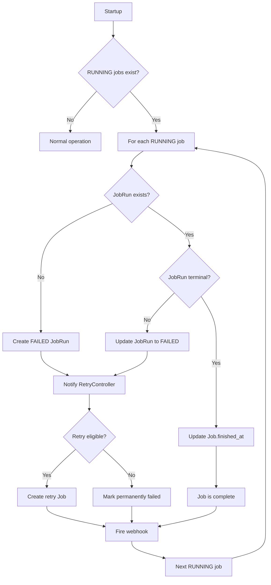
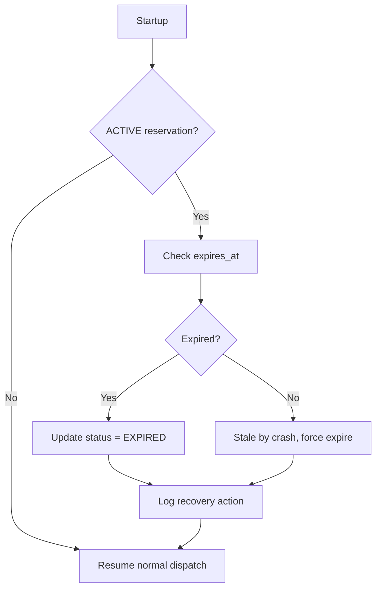
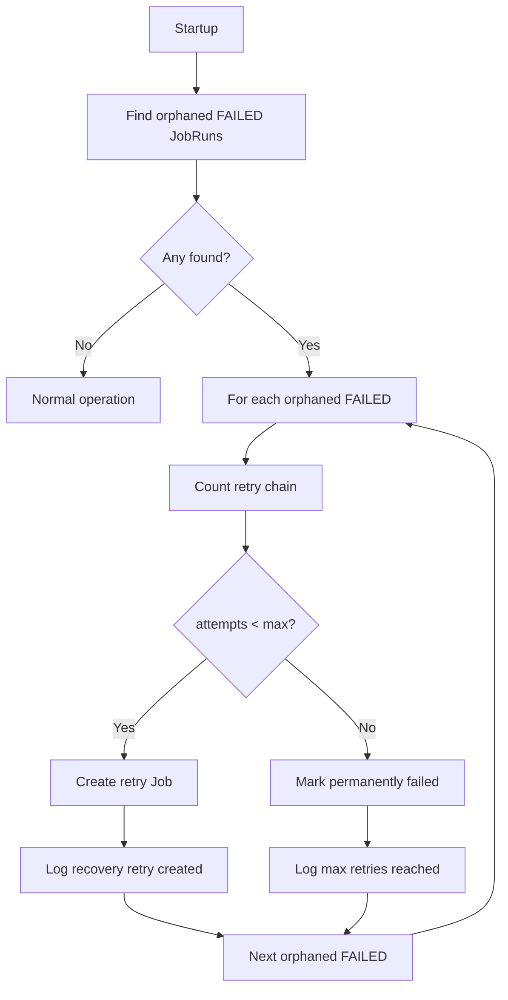

# Job Scheduler Recovery Scenarios

> **Status:** FINAL (Phase 5 Complete)
> **Document Version:** 1.0.0
> **Application Version:** 1.5.0 (managed by release-please)
> **Last Updated:** 2026-01-18

---

## Purpose

This document provides detailed timeline-style analysis of failure and recovery scenarios.
Each scenario includes:
- Failure point identification
- Detection mechanism
- Correction flow
- Safety explanation

---

## Scenario 1: Crash During Job Execution

### Timeline

```
Time    Event                           State
─────────────────────────────────────────────────────────────
t0      Job1 created                    Job1: QUEUED
t1      Dispatcher claims Job1          Job1: RUNNING
t2      JobRun1 created                 JobRun1: (started)
t3      Execution in progress           Job1: RUNNING
t4      ████ CRASH ████                 Process terminates

─── RESTART ───

t5      Scheduler starts                Loading state...
t6      Recovery scan begins            Scanning RUNNING jobs
t7      Job1 found RUNNING              Needs recovery
t8      JobRun1 found (no terminal)     Execution was interrupted
t9      JobRun1 → FAILED                error="Crash recovery"
t10     RetryController notified        Evaluate retry eligibility
t11     Job2 created (retry)            Job2: QUEUED, retry_of=Job1
t12     Webhook fired                   job.run.failed
t13     Normal dispatch resumes         Queue operational
```

### Detection Mechanism

```
On Startup:
  SELECT j.job_id, jr.run_id, jr.status
  FROM jobs j
  LEFT JOIN job_runs jr ON j.job_id = jr.job_id
  WHERE j.status = 'RUNNING'
```

| Query Result | Interpretation | Action |
|--------------|----------------|--------|
| Job RUNNING, no JobRun | Crash before JobRun created | Create FAILED JobRun |
| Job RUNNING, JobRun non-terminal | Crash during execution | Update JobRun to FAILED |
| Job RUNNING, JobRun terminal | Crash after completion | Update Job.finished_at only |

### Correction Flow



### Why This Is Safe

1. **No Silent Failures**: Every RUNNING job is explicitly handled on restart.

2. **No Duplicate Execution**: Crashed job is marked FAILED, not re-queued. Retry creates NEW job.

3. **Audit Trail Preserved**: JobRun record exists with error explanation.

4. **Retry Mechanism Works**: RetryController applies normal retry policy.

5. **Webhook Notification**: External systems are informed of failure.

---

## Scenario 2: Crash During Direct API Reservation

### Timeline

```
Time    Event                           State
─────────────────────────────────────────────────────────────
t0      Queue: [Job1, Job2, Job3]       All QUEUED
t1      Direct API request arrives      Client waiting
t2      Reservation created             reservation: ACTIVE
t3      Job1 dispatched (pre-existing)  Job1: RUNNING
t4      ████ CRASH ████                 Process terminates

─── RESTART ───

t5      Scheduler starts                Loading state...
t6      Recovery scan: reservations     Found ACTIVE reservation
t7      Check expires_at                Is it stale?
t8      Reservation expired             Update: EXPIRED
t9      Queue unlocked                  Dispatch can resume
t10     Normal dispatch: Job2           Job2: RUNNING

─── CLIENT SIDE ───
t4'     Request timeout                 No response received
t11     Client may retry                New request, new reservation
```

### Detection Mechanism

```
On Startup:
  SELECT * FROM direct_reservations
  WHERE status = 'ACTIVE'
```

| Query Result | Condition | Action |
|--------------|-----------|--------|
| ACTIVE reservation, expired | `expires_at < now()` | Update to EXPIRED |
| ACTIVE reservation, not expired | Should not happen (crash = no handler) | Expire anyway (stale) |
| No ACTIVE reservation | Normal | Resume dispatch |

### Correction Flow



### Why This Is Safe

1. **Queue Not Corrupted**: Reservation only pauses dispatch, doesn't modify queue.

2. **No Stuck State**: Expiration timeout guarantees queue eventually resumes.

3. **Client Knows Failure**: No response = client can retry.

4. **No Duplicate Direct Execution**: Original request never completed; new request is fresh.

5. **Recommended Expiry**: 5-10 minutes prevents indefinite blocking.

---

## Scenario 3: Crash During Retry Job Creation

### Timeline

```
Time    Event                           State
─────────────────────────────────────────────────────────────
t0      Job1 executing                  Job1: RUNNING
t1      Job1 fails                      JobRun1: FAILED
t2      RetryController: count=0        Eligible for retry
t3      ████ CRASH ████                 Before Job2 created

─── RESTART ───

t4      Scheduler starts                Loading state...
t5      Recovery scan: FAILED runs      Found JobRun1 FAILED
t6      Check retry chain               retry_of chain length = 0
t7      Check retry Job exists?         No Job with retry_of=Job1
t8      Create Job2                     Job2: QUEUED, retry_of=Job1
t9      Normal dispatch resumes         Queue operational
```

### Detection Mechanism

```
On Startup:
  SELECT jr.*, j.job_id
  FROM job_runs jr
  JOIN jobs j ON jr.job_id = j.job_id
  WHERE jr.status = 'FAILED'
    AND NOT EXISTS (
      SELECT 1 FROM jobs retry
      WHERE retry.retry_of = j.job_id
    )
```

This finds FAILED JobRuns without a corresponding retry Job.

### Correction Flow



### Why This Is Safe

1. **Idempotent Check**: "Does retry Job exist?" prevents duplicates.

2. **Chain Counting Works**: `retry_of` traversal gives accurate attempt count.

3. **No Lost Retries**: Eligible retries are created on restart.

4. **Max Retry Respected**: Permanently failed jobs stay failed.

---

## Scenario 4: Crash During JobRun Creation

### Timeline

```
Time    Event                           State
─────────────────────────────────────────────────────────────
t0      Job1 in queue                   Job1: QUEUED
t1      Dispatcher claims Job1          BEGIN transaction
t2      Job1 status → RUNNING           Job1: RUNNING (uncommitted)
t3      ████ CRASH ████                 Transaction not committed

─── RESTART ───

t4      Scheduler starts                Loading state...
t5      SQLite rollback                 Uncommitted changes gone
t6      Job1 status = QUEUED            Transaction rolled back
t7      Normal dispatch resumes         Job1 will be dispatched again
```

### Detection Mechanism

This scenario is handled **automatically by SQLite** transaction rollback.

```
If crash occurs during uncommitted transaction:
  - SQLite journal/WAL detects incomplete transaction
  - All changes in transaction are rolled back
  - Database returns to last consistent state
```

### Why This Is Safe

1. **ACID Transactions**: SQLite guarantees atomicity.

2. **No Partial State**: Either both Job.status and JobRun are written, or neither.

3. **Automatic Recovery**: No application-level handling needed.

4. **Job Gets Retry**: Rolled-back job remains QUEUED, will be dispatched.

---

## Scenario 5: Crash With Multiple RUNNING Jobs (Edge Case)

### Context

Although CON-002 (Ollama exclusivity) typically means one job at a time,
this scenario covers potential future multi-worker configurations.

### Timeline

```
Time    Event                           State
─────────────────────────────────────────────────────────────
t0      Job1, Job2 executing            Job1: RUNNING, Job2: RUNNING
t1      ████ CRASH ████                 Process terminates

─── RESTART ───

t2      Scheduler starts                Loading state...
t3      Find all RUNNING jobs           [Job1, Job2]
t4      Process Job1                    JobRun1 → FAILED
t5      Process Job2                    JobRun2 → FAILED
t6      RetryController: both           Both eligible for retry
t7      Job3, Job4 created              Retry jobs queued
t8      Normal dispatch resumes         One at a time (per constraint)
```

### Ordering After Recovery

```
Before crash:
  Queue: [Job3, Job4, Job5] (waiting)
  Running: [Job1, Job2]

After recovery:
  Queue: [Job1-retry, Job2-retry, Job3, Job4, Job5]

Retry jobs are queued at normal priority, maintaining fairness.
```

### Why This Is Safe

1. **All RUNNING Jobs Handled**: Loop processes every RUNNING job found.

2. **Independent Recovery**: Each job's recovery is independent.

3. **Queue Integrity**: Original queue order preserved for waiting jobs.

4. **Retry Fairness**: Retry jobs enter queue, don't jump ahead unfairly.

---

## Scenario 6: Rapid Restart (Crash → Recover → Crash)

### Timeline

```
Time    Event                           State
─────────────────────────────────────────────────────────────
t0      Job1 executing                  Job1: RUNNING
t1      ████ CRASH #1 ████

─── RESTART #1 ───

t2      Recovery starts
t3      Job1 found RUNNING
t4      ████ CRASH #2 ████              Before recovery completes

─── RESTART #2 ───

t5      Recovery starts
t6      Job1 STILL RUNNING              Still needs recovery
t7      Process Job1                    JobRun1 → FAILED
t8      Retry Job created               Normal flow
```

### Detection Mechanism

Recovery logic is **idempotent**:
- Same query runs: find RUNNING jobs
- Same condition: Job1 still RUNNING (no one changed it)
- Same action: Mark FAILED, create retry

### Why This Is Safe

1. **Idempotent Recovery**: Can run recovery multiple times with same result.

2. **No Partial Recovery State**: Either fully recovered or not.

3. **Eventual Completion**: Recovery will eventually complete.

4. **No Accumulating Damage**: Each crash doesn't make things worse.

---

## Recovery Invariants Summary

| Invariant | Guarantee |
|-----------|-----------|
| **No Lost Jobs** | QUEUED jobs always survive restart |
| **No Ghost RUNNING** | All RUNNING jobs are resolved on recovery |
| **No Duplicate Execution** | RUNNING → FAILED, never RUNNING → QUEUED |
| **No Lost Retries** | Eligible retries are created if missing |
| **No Stuck Reservation** | Expiration timeout releases queue |
| **Idempotent Recovery** | Multiple recovery runs produce same result |
| **Deterministic Order** | Queue order after recovery is predictable |

---

## Testing Recommendations

For each scenario, implementation tests should verify:

1. **State Before Crash**: Set up the pre-crash state in SQLite
2. **Simulate Restart**: Call recovery logic
3. **Verify State After**: Assert expected post-recovery state
4. **Verify Idempotency**: Run recovery again, assert no change

Example test structure:
```
test_crash_during_running_job:
  setup:
    - Insert Job1 with status=RUNNING
    - Insert JobRun1 with no terminal status
  execute:
    - Call recovery_on_startup()
  verify:
    - JobRun1.status == FAILED
    - JobRun1.error contains "crash recovery"
    - Retry Job exists with retry_of = Job1
  idempotency:
    - Call recovery_on_startup() again
    - No new retry Job created
```

---

## Document History

| Version | Date | Author | Changes |
|---------|------|--------|---------|
| 0.1.0 | 2026-01-18 | - | Initial recovery scenarios |

