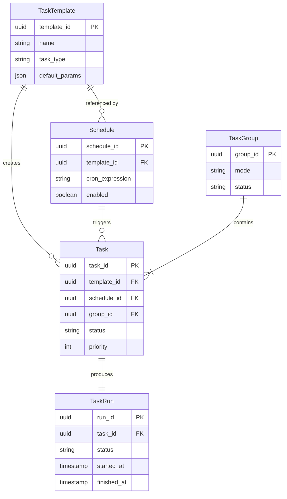

# Task Scheduler Entity Relationships

> **Status:** FINAL (Phase 5 Complete)
> **Document Version:** 1.0.0
> **Application Version:** 1.7.0 <!-- x-release-please-version -->
> **Last Updated:** 2026-01-18

---

## Overview

This document defines the relationships between Task Scheduler entities. It covers cardinality, ownership semantics, creation triggers, and lifecycle dependencies. These relationships form the foundation for API contract design and database schema decisions.

---

## Entity Relationship Diagram

### High-Level Overview (Mermaid)



### ASCII Diagram

```
┌─────────────────┐
│   TaskTemplate   │
│  (Definition)   │
└────────┬────────┘
         │ 1:N (creates)
         │
         ├──────────────────────────────┐
         │                              │
         ▼                              ▼
┌─────────────────┐            ┌─────────────────┐
│    Schedule     │            │      Task       │
│   (Temporal)    │────────────│  (Execution)    │
└─────────────────┘  1:N       └────────┬────────┘
                  (triggers)            │
                                        │ 1:1
                                        ▼
                               ┌─────────────────┐
                               │    TaskRun       │
                               │   (History)     │
                               └─────────────────┘

┌─────────────────┐
│    TaskGroup     │
│   (Grouping)    │
└────────┬────────┘
         │ 1:N (contains)
         ▼
┌─────────────────┐
│      Task       │
│  (Members)      │
└─────────────────┘
```

---

## Relationship Details

### 1. TaskTemplate → Task

| Aspect | Description |
|--------|-------------|
| **Cardinality** | One-to-Many (1:N) |
| **Direction** | TaskTemplate is the parent, Task is the child |
| **Optionality** | Task.template_id is NULLABLE (ad-hoc tasks) |
| **Ownership** | Non-owning reference (soft reference) |
| **Cascade Delete** | NO - Tasks persist when template archived |

#### Creation Trigger

Tasks referencing a template are created when:
1. **Manual trigger**: User explicitly requests task creation from template
2. **Schedule trigger**: A Schedule's cron expression fires
3. **API call**: Direct API call specifying template_id

#### Lifecycle Dependency

```
TaskTemplate ARCHIVED → Existing Tasks: Unaffected
                     → New Tasks: Cannot be created from this template
                     → Active Schedules: Should be disabled (warning)
```

---

### 2. TaskTemplate → Schedule

| Aspect | Description |
|--------|-------------|
| **Cardinality** | One-to-Many (1:N) |
| **Direction** | TaskTemplate is referenced, Schedule is the referencer |
| **Optionality** | Schedule.template_id is REQUIRED |
| **Ownership** | Non-owning reference |
| **Cascade Delete** | NO - Schedules become invalid, not deleted |

#### Relationship Semantics

- A Schedule MUST reference exactly one TaskTemplate
- A TaskTemplate MAY be referenced by zero or more Schedules
- Multiple Schedules can use the same template with different timing/overrides

#### Example

```
TaskTemplate: "daily-research"
├── Schedule: "morning-run" (cron: 0 9 * * *)
├── Schedule: "evening-run" (cron: 0 21 * * *)
└── Schedule: "weekend-deep" (cron: 0 10 * * SAT, param_overrides: {depth: "deep"})
```

---

### 3. Schedule → Task

| Aspect | Description |
|--------|-------------|
| **Cardinality** | One-to-Many (1:N) |
| **Direction** | Schedule triggers, Task is triggered |
| **Optionality** | Task.schedule_id is NULLABLE (manual tasks) |
| **Ownership** | Non-owning reference (audit trail only) |
| **Cascade Delete** | NO - Tasks persist for historical audit |

#### Creation Trigger

A Schedule creates a Task when:
1. **Cron fires**: The cron expression matches current time
2. **Catch-up mode**: System recovery after downtime (configurable)
3. **Manual force-trigger**: Admin forces schedule execution

#### Trigger Decision Flow

```
Schedule.cron_expression matches NOW?
├── NO → Do nothing
└── YES → Schedule.enabled?
          ├── NO → Do nothing (log skip)
          └── YES → Template exists and ACTIVE?
                    ├── NO → Log error, optionally disable schedule
                    └── YES → Create Task with:
                              - template_id from Schedule
                              - schedule_id = this Schedule
                              - params = merge(template.default_params, schedule.param_overrides)
                              - priority = schedule.priority OR default
```

---

### 4. Task → TaskRun

| Aspect | Description |
|--------|-------------|
| **Cardinality** | One-to-One (1:1) |
| **Direction** | Task produces TaskRun |
| **Optionality** | TaskRun.task_id is REQUIRED |
| **Ownership** | TaskRun is owned by Task |
| **Cascade Delete** | CONFIGURABLE - depends on retention policy |

#### Why 1:1, Not 1:N?

We chose 1:1 over 1:N (retry model) for clarity:
- Each Task represents ONE execution attempt
- Retries create NEW Tasks (with `retry_of` reference)
- Simpler state machine, clearer audit trail

#### Alternative Considered

```
# Rejected: 1:N model with retries as TaskRuns
Task
├── TaskRun (attempt 1, FAILED)
├── TaskRun (attempt 2, FAILED)
└── TaskRun (attempt 3, COMPLETED)

# Accepted: 1:1 model with retry chain
Task1 → TaskRun1 (FAILED), retry_of: null
Task2 → TaskRun2 (FAILED), retry_of: Task1
Task3 → TaskRun3 (COMPLETED), retry_of: Task2
```

#### Creation Trigger

TaskRun is created when:
1. **Task dispatched**: Worker picks up Task from queue
2. **Execution starts**: First line of actual work begins

```
Task.status = QUEUED
        ↓ (worker claims task)
Task.status = RUNNING + TaskRun created
        ↓ (execution completes)
TaskRun.status = COMPLETED | FAILED | SKIPPED
```

> Note: DISPATCHED is an internal transition state, not externally visible.

---

### 5. TaskGroup → Task

| Aspect | Description |
|--------|-------------|
| **Cardinality** | One-to-Many (1:N) |
| **Direction** | TaskGroup contains Tasks |
| **Optionality** | Task.group_id is NULLABLE (ungrouped tasks) |
| **Ownership** | Loose ownership (coordination, not lifecycle) |
| **Cascade Delete** | NO - Tasks can exist without group |

#### Ordering Within Group

Tasks within a group maintain explicit ordering via `position` field:

```
TaskGroup (mode: sequential)
├── Task (position: 1) → Executes first
├── Task (position: 2) → Waits for position 1
└── Task (position: 3) → Waits for position 2

TaskGroup (mode: parallel)
├── Task (position: 1) ┐
├── Task (position: 2) ├→ All execute concurrently
└── Task (position: 3) ┘
```

#### Group Status Derivation

Group status is derived from member Task and TaskRun statuses:

```
All Tasks QUEUED             → Group QUEUED
Any Task RUNNING             → Group RUNNING
All Tasks reach terminal     → Group terminal (see below)

Terminal derivation (based on TaskRun results):
- All TaskRuns COMPLETED     → Group COMPLETED
- Any TaskRun FAILED         → Group PARTIAL
- All Tasks CANCELLED        → Group CANCELLED
```

---

## Ownership Summary Table

| Relationship | Owner | Owned | Cascade Delete? |
|--------------|-------|-------|-----------------|
| TaskTemplate → Schedule | Neither | Neither | No |
| TaskTemplate → Task | Neither | Neither | No |
| Schedule → Task | Neither | Neither | No |
| Task → TaskRun | Task | TaskRun | Configurable |
| TaskGroup → Task | TaskGroup (loose) | Task | No |

---

## Reference Integrity Rules

### Hard References (Required)

| Entity | Field | Constraint |
|--------|-------|------------|
| Schedule | template_id | MUST exist, MUST be ACTIVE |
| TaskRun | task_id | MUST exist |

### Soft References (Optional)

| Entity | Field | Constraint |
|--------|-------|------------|
| Task | template_id | MAY be null (ad-hoc) |
| Task | schedule_id | MAY be null (manual) |
| Task | group_id | MAY be null (ungrouped) |

### Snapshot References

Some references are snapshots at creation time (denormalized for audit):

| Entity | Field | Source | Purpose |
|--------|-------|--------|---------|
| TaskRun | template_id | Task.template_id | Audit trail |
| TaskRun | params_snapshot | Task.params | Reproduce execution |

---

## Creation Flow Diagrams

### Flow 1: Schedule-Triggered Task

```
┌─────────┐    cron fires    ┌──────────┐
│ Schedule │ ───────────────► │  Check   │
└─────────┘                   │ Enabled? │
                              └────┬─────┘
                                   │ yes
                              ┌────▼─────┐
                              │  Lookup  │
                              │ Template │
                              └────┬─────┘
                                   │ found
                              ┌────▼─────┐
                              │  Create  │
                              │   Task   │
                              └────┬─────┘
                                   │
                              ┌────▼─────┐
                              │  Enqueue │
                              │ (QUEUED) │
                              └──────────┘
```

### Flow 2: Manual Task from Template

```
┌──────────┐   POST /tasks    ┌──────────┐
│   User   │ ───────────────► │ Validate │
└──────────┘                  │ Template │
                              └────┬─────┘
                                   │ valid
                              ┌────▼─────┐
                              │  Merge   │
                              │  Params  │
                              └────┬─────┘
                                   │
                              ┌────▼─────┐
                              │  Create  │
                              │   Task   │
                              └────┬─────┘
                                   │
                              ┌────▼─────┐
                              │  Enqueue │
                              │ (QUEUED) │
                              └──────────┘
```

### Flow 3: Task Execution

```
┌──────────┐   poll queue    ┌──────────┐
│  Worker  │ ───────────────► │  Claim   │
└──────────┘                  │   Task   │
                              └────┬─────┘
                                   │
                              ┌────▼─────┐
                              │ DISPATCH │
                              │ Task.sta │
                              └────┬─────┘
                                   │
                              ┌────▼─────┐
                              │  Create  │
                              │  TaskRun  │
                              └────┬─────┘
                                   │
                              ┌────▼─────┐
                              │ Execute  │
                              │   Work   │
                              └────┬─────┘
                                   │
                              ┌────▼─────┐
                              │ Finalize │
                              │ Both Ent │
                              └──────────┘
```

---

## Cross-Reference Matrix

Shows which entities reference which:

|                | TaskTemplate | Schedule | Task | TaskRun | TaskGroup |
|----------------|:-----------:|:--------:|:---:|:------:|:--------:|
| **TaskTemplate**| -           | -        | -   | -      | -        |
| **Schedule**   | ✓ required  | -        | -   | -      | -        |
| **Task**        | ○ optional  | ○ optional| -  | -      | ○ optional|
| **TaskRun**     | ✓ snapshot  | -        | ✓ required | - | -   |
| **TaskGroup**   | -           | -        | -   | -      | -        |

Legend:
- ✓ required = Foreign key, must exist
- ○ optional = Nullable foreign key
- ✓ snapshot = Denormalized copy for audit

---

## Glossary

| Term | Definition |
|------|------------|
| **Hard Reference** | Non-nullable FK, target must exist |
| **Soft Reference** | Nullable FK, target may not exist |
| **Snapshot Reference** | Copied value at creation time, immutable |
| **Cascade Delete** | Deleting parent automatically deletes children |
| **Loose Ownership** | Logical grouping without lifecycle dependency |
| **Derived Status** | Status computed from related entity states |

---

## Related Documents

- [DOMAIN_MODEL.md](./DOMAIN_MODEL.md) - 도메인 모델 정의
- [PERSISTENCE_SCHEMA.md](./PERSISTENCE_SCHEMA.md) - 영속성 스키마
- [DESIGN_GUARDS.md](./DESIGN_GUARDS.md) - 설계 가드레일
- [TASK_SCHEDULER_DESIGN.md](../technical/TASK_SCHEDULER_DESIGN.md) - 시스템 설계 개요

