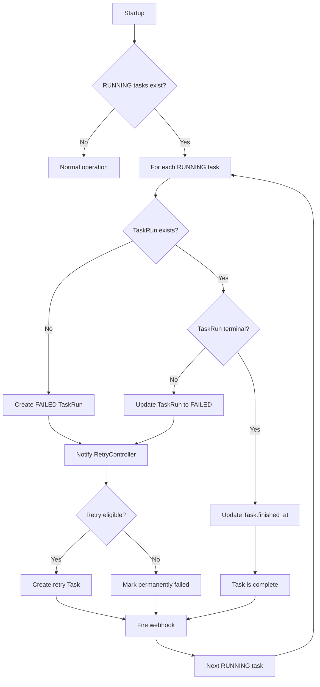
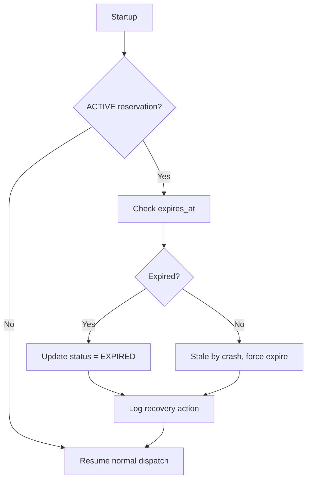
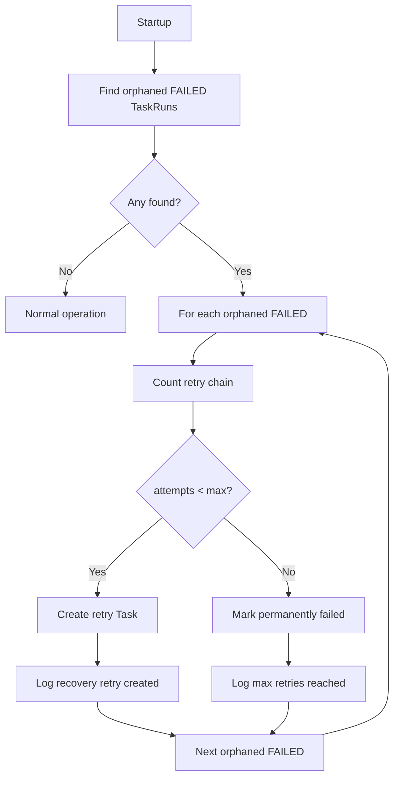

# Task Scheduler Recovery Scenarios

> **Status:** FINAL (Phase 5 Complete)
> **Document Version:** 1.0.0
> **Application Version:** 1.7.0 <!-- x-release-please-version -->
> **Last Updated:** 2026-01-18

---

## Purpose

This document provides detailed timeline-style analysis of failure and recovery scenarios.
Each scenario includes:
- Failure point identification
- Detection mechanism
- Correction flow
- Safety explanation

---

## Scenario 1: Crash During Task Execution

### Timeline

```
Time    Event                           State
─────────────────────────────────────────────────────────────
t0      Task1 created                    Task1: QUEUED
t1      Dispatcher claims Task1          Task1: RUNNING
t2      TaskRun1 created                 TaskRun1: (started)
t3      Execution in progress           Task1: RUNNING
t4      ████ CRASH ████                 Process terminates

─── RESTART ───

t5      Scheduler starts                Loading state...
t6      Recovery scan begins            Scanning RUNNING tasks
t7      Task1 found RUNNING              Needs recovery
t8      TaskRun1 found (no terminal)     Execution was interrupted
t9      TaskRun1 → FAILED                error="Crash recovery"
t10     RetryController notified        Evaluate retry eligibility
t11     Task2 created (retry)            Task2: QUEUED, retry_of=Task1
t12     Webhook fired                   task.run.failed
t13     Normal dispatch resumes         Queue operational
```

### Detection Mechanism

```
On Startup:
  SELECT j.task_id, jr.run_id, jr.status
  FROM tasks j
  LEFT JOIN task_runs jr ON j.task_id = jr.task_id
  WHERE j.status = 'RUNNING'
```

| Query Result | Interpretation | Action |
|--------------|----------------|--------|
| Task RUNNING, no TaskRun | Crash before TaskRun created | Create FAILED TaskRun |
| Task RUNNING, TaskRun non-terminal | Crash during execution | Update TaskRun to FAILED |
| Task RUNNING, TaskRun terminal | Crash after completion | Update Task.finished_at only |

### Correction Flow



### Why This Is Safe

1. **No Silent Failures**: Every RUNNING task is explicitly handled on restart.

2. **No Duplicate Execution**: Crashed task is marked FAILED, not re-queued. Retry creates NEW task.

3. **Audit Trail Preserved**: TaskRun record exists with error explanation.

4. **Retry Mechanism Works**: RetryController applies normal retry policy.

5. **Webhook Notification**: External systems are informed of failure.

---

## Scenario 2: Crash During Direct API Reservation

### Timeline

```
Time    Event                           State
─────────────────────────────────────────────────────────────
t0      Queue: [Task1, Task2, Task3]       All QUEUED
t1      Direct API request arrives      Client waiting
t2      Reservation created             reservation: ACTIVE
t3      Task1 dispatched (pre-existing)  Task1: RUNNING
t4      ████ CRASH ████                 Process terminates

─── RESTART ───

t5      Scheduler starts                Loading state...
t6      Recovery scan: reservations     Found ACTIVE reservation
t7      Check expires_at                Is it stale?
t8      Reservation expired             Update: EXPIRED
t9      Queue unlocked                  Dispatch can resume
t10     Normal dispatch: Task2           Task2: RUNNING

─── CLIENT SIDE ───
t4'     Request timeout                 No response received
t11     Client may retry                New request, new reservation
```

### Detection Mechanism

```
On Startup:
  SELECT * FROM direct_reservations
  WHERE status = 'ACTIVE'
```

| Query Result | Condition | Action |
|--------------|-----------|--------|
| ACTIVE reservation, expired | `expires_at < now()` | Update to EXPIRED |
| ACTIVE reservation, not expired | Should not happen (crash = no handler) | Expire anyway (stale) |
| No ACTIVE reservation | Normal | Resume dispatch |

### Correction Flow



### Why This Is Safe

1. **Queue Not Corrupted**: Reservation only pauses dispatch, doesn't modify queue.

2. **No Stuck State**: Expiration timeout guarantees queue eventually resumes.

3. **Client Knows Failure**: No response = client can retry.

4. **No Duplicate Direct Execution**: Original request never completed; new request is fresh.

5. **Recommended Expiry**: 5-10 minutes prevents indefinite blocking.

---

## Scenario 3: Crash During Retry Task Creation

### Timeline

```
Time    Event                           State
─────────────────────────────────────────────────────────────
t0      Task1 executing                  Task1: RUNNING
t1      Task1 fails                      TaskRun1: FAILED
t2      RetryController: count=0        Eligible for retry
t3      ████ CRASH ████                 Before Task2 created

─── RESTART ───

t4      Scheduler starts                Loading state...
t5      Recovery scan: FAILED runs      Found TaskRun1 FAILED
t6      Check retry chain               retry_of chain length = 0
t7      Check retry task exists?         No Task with retry_of=Task1
t8      Create Task2                     Task2: QUEUED, retry_of=Task1
t9      Normal dispatch resumes         Queue operational
```

### Detection Mechanism

```
On Startup:
  SELECT jr.*, j.task_id
  FROM task_runs jr
  JOIN tasks j ON jr.task_id = j.task_id
  WHERE jr.status = 'FAILED'
    AND NOT EXISTS (
      SELECT 1 FROM tasks retry
      WHERE retry.retry_of = j.task_id
    )
```

This finds FAILED TaskRuns without a corresponding retry task.

### Correction Flow



### Why This Is Safe

1. **Idempotent Check**: "Does retry task exist?" prevents duplicates.

2. **Chain Counting Works**: `retry_of` traversal gives accurate attempt count.

3. **No Lost Retries**: Eligible retries are created on restart.

4. **Max Retry Respected**: Permanently failed tasks stay failed.

---

## Scenario 4: Crash During TaskRun Creation

### Timeline

```
Time    Event                           State
─────────────────────────────────────────────────────────────
t0      Task1 in queue                   Task1: QUEUED
t1      Dispatcher claims Task1          BEGIN transaction
t2      Task1 status → RUNNING           Task1: RUNNING (uncommitted)
t3      ████ CRASH ████                 Transaction not committed

─── RESTART ───

t4      Scheduler starts                Loading state...
t5      SQLite rollback                 Uncommitted changes gone
t6      Task1 status = QUEUED            Transaction rolled back
t7      Normal dispatch resumes         Task1 will be dispatched again
```

### Detection Mechanism

This scenario is handled **automatically by SQLite** transaction rollback.

```
If crash occurs during uncommitted transaction:
  - SQLite journal/WAL detects incomplete transaction
  - All changes in transaction are rolled back
  - Database returns to last consistent state
```

### Why This Is Safe

1. **ACID Transactions**: SQLite guarantees atomicity.

2. **No Partial State**: Either both Task.status and TaskRun are written, or neither.

3. **Automatic Recovery**: No application-level handling needed.

4. **Task Gets Retry**: Rolled-back task remains QUEUED, will be dispatched.

---

## Scenario 5: Crash With Multiple RUNNING Tasks (Edge Case)

### Context

Although CON-002 (Ollama exclusivity) typically means one task at a time,
this scenario covers potential future multi-worker configurations.

### Timeline

```
Time    Event                           State
─────────────────────────────────────────────────────────────
t0      Task1, Task2 executing            Task1: RUNNING, Task2: RUNNING
t1      ████ CRASH ████                 Process terminates

─── RESTART ───

t2      Scheduler starts                Loading state...
t3      Find all RUNNING tasks           [Task1, Task2]
t4      Process Task1                    TaskRun1 → FAILED
t5      Process Task2                    TaskRun2 → FAILED
t6      RetryController: both           Both eligible for retry
t7      Task3, Task4 created              Retry tasks queued
t8      Normal dispatch resumes         One at a time (per constraint)
```

### Ordering After Recovery

```
Before crash:
  Queue: [Task3, Task4, Task5] (waiting)
  Running: [Task1, Task2]

After recovery:
  Queue: [Task1-retry, Task2-retry, Task3, Task4, Task5]

Retry tasks are queued at normal priority, maintaining fairness.
```

### Why This Is Safe

1. **All RUNNING Tasks Handled**: Loop processes every RUNNING task found.

2. **Independent Recovery**: Each task's recovery is independent.

3. **Queue Integrity**: Original queue order preserved for waiting tasks.

4. **Retry Fairness**: Retry tasks enter queue, don't jump ahead unfairly.

---

## Scenario 6: Rapid Restart (Crash → Recover → Crash)

### Timeline

```
Time    Event                           State
─────────────────────────────────────────────────────────────
t0      Task1 executing                  Task1: RUNNING
t1      ████ CRASH #1 ████

─── RESTART #1 ───

t2      Recovery starts
t3      Task1 found RUNNING
t4      ████ CRASH #2 ████              Before recovery completes

─── RESTART #2 ───

t5      Recovery starts
t6      Task1 STILL RUNNING              Still needs recovery
t7      Process Task1                    TaskRun1 → FAILED
t8      Retry task created               Normal flow
```

### Detection Mechanism

Recovery logic is **idempotent**:
- Same query runs: find RUNNING tasks
- Same condition: Task1 still RUNNING (no one changed it)
- Same action: Mark FAILED, create retry

### Why This Is Safe

1. **Idempotent Recovery**: Can run recovery multiple times with same result.

2. **No Partial Recovery State**: Either fully recovered or not.

3. **Eventual Completion**: Recovery will eventually complete.

4. **No Accumulating Damage**: Each crash doesn't make things worse.

---

## Recovery Invariants Summary

| Invariant | Guarantee |
|-----------|-----------|
| **No Lost Tasks** | QUEUED tasks always survive restart |
| **No Ghost RUNNING** | All RUNNING tasks are resolved on recovery |
| **No Duplicate Execution** | RUNNING → FAILED, never RUNNING → QUEUED |
| **No Lost Retries** | Eligible retries are created if missing |
| **No Stuck Reservation** | Expiration timeout releases queue |
| **Idempotent Recovery** | Multiple recovery runs produce same result |
| **Deterministic Order** | Queue order after recovery is predictable |

---

## Testing Recommendations

For each scenario, implementation tests should verify:

1. **State Before Crash**: Set up the pre-crash state in SQLite
2. **Simulate Restart**: Call recovery logic
3. **Verify State After**: Assert expected post-recovery state
4. **Verify Idempotency**: Run recovery again, assert no change

Example test structure:
```
test_crash_during_running_task:
  setup:
    - Insert Task1 with status=RUNNING
    - Insert TaskRun1 with no terminal status
  execute:
    - Call recovery_on_startup()
  verify:
    - TaskRun1.status == FAILED
    - TaskRun1.error contains "crash recovery"
    - Retry task exists with retry_of = Task1
  idempotency:
    - Call recovery_on_startup() again
    - No new retry task created
```

---

## Document History

| Version | Date | Author | Changes |
|---------|------|--------|---------|
| 0.1.0 | 2026-01-18 | - | Initial recovery scenarios |

---

## Related Documents

- [PERSISTENCE_SCHEMA.md](./PERSISTENCE_SCHEMA.md) - 영속성 스키마
- [DESIGN_GUARDS.md](./DESIGN_GUARDS.md) - 설계 가드레일
- [TEST_STRATEGY.md](./TEST_STRATEGY.md) - 테스트 전략
- [E2E_TEST_PLAN.md](./E2E_TEST_PLAN.md) - E2E 테스트 계획
- [TASK_SCHEDULER_DESIGN.md](../technical/TASK_SCHEDULER_DESIGN.md) - 시스템 설계 개요

