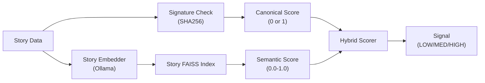

# Story Semantic Dedup Setup

**Date:** 2026-01-15
**Version:** v1.4.0
**Status:** ACTIVE

---

## Overview

The story semantic deduplication system extends the existing signature-based dedup with FAISS-based semantic similarity detection. It uses a **hybrid scoring approach** that combines exact signature matching with embedding-based content similarity.

---

## Architecture



### Components

| Component | File | Description |
|-----------|------|-------------|
| Story Embedder | `src/dedup/story/embedder.py` | Creates story text for embedding |
| Story FAISS Index | `src/dedup/story/index.py` | Stores and searches story vectors |
| Semantic Dedup | `src/dedup/story/semantic_dedup.py` | Semantic similarity check |
| Hybrid Dedup | `src/dedup/story/hybrid_dedup.py` | Combines canonical + semantic |
| Integration | `src/story/dedup/story_dedup_check.py` | Main dedup entry point |

---

## Hybrid Scoring

The system combines two deduplication strategies:

```
hybrid_score = (canonical_score × 0.3) + (semantic_score × 0.7)
```

| Component | Weight | Description |
|-----------|--------|-------------|
| Canonical | 30% | SHA256 signature exact match (0 or 1) |
| Semantic | 70% | `nomic-embed-text` cosine similarity |

### Why Hybrid?

- **Signature-only limitation**: Only detects exact structural duplicates (same canonical_core + research_used)
- **Semantic-only limitation**: May miss structurally identical but textually different stories
- **Hybrid advantage**: Catches both exact duplicates and semantically similar stories

---

## Ollama Model Requirements

### Embedding Model (Required)

Uses the same embedding model as research dedup:

```bash
# Install the embedding model
ollama pull nomic-embed-text
```

**Model Specifications:**
- Name: `nomic-embed-text`
- Embedding Dimension: 768
- API Endpoint: `/api/embed`

---

## Configuration

### Environment Variables

| Variable | Default | Description |
|----------|---------|-------------|
| `ENABLE_STORY_SEMANTIC_DEDUP` | `true` | Enable semantic embedding dedup |
| `STORY_SEMANTIC_THRESHOLD` | `0.85` | Semantic HIGH signal threshold |
| `STORY_HYBRID_THRESHOLD` | `0.85` | Hybrid duplicate detection threshold |
| `STORY_HYBRID_CANONICAL_WEIGHT` | `0.3` | Canonical component weight |
| `STORY_HYBRID_SEMANTIC_WEIGHT` | `0.7` | Semantic component weight |

### Signal Thresholds

| Signal | Score Range | Behavior |
|--------|-------------|----------|
| `LOW` | < 0.70 | Accept story |
| `MEDIUM` | 0.70 - 0.85 | Accept with logging |
| `HIGH` | >= 0.85 | Duplicate detected |

---

## Story Text for Embedding

The embedder extracts a normalized text representation from story data:

```python
def create_story_text_for_embedding(story_data: dict) -> str:
    """
    Combines story components for embedding:
    - Title
    - Summary/semantic_summary
    - Canonical core (setting, fear, antagonist)
    - Body (truncated to max_body_chars)
    """
```

**Example Output:**
```
Title: The Haunted Apartment
Summary: A story about isolation and technology in a modern apartment
Core: setting=apartment, fear=isolation, antagonist=technology
Content: It was a dark night when the automated systems began to fail...
```

---

## Usage

### Check Duplicate (Hybrid)

```python
from src.story.dedup import check_story_duplicate_hybrid

result = check_story_duplicate_hybrid(
    canonical_core={
        "setting_archetype": "apartment",
        "primary_fear": "isolation",
        "antagonist_archetype": "technology",
        "threat_mechanism": "surveillance",
        "twist_family": "revelation"
    },
    research_used=["RC-20260115-123456"],
    story_data={
        "title": "The Watching Walls",
        "body": "The apartment's smart systems never slept...",
        "semantic_summary": "A technology horror about surveillance"
    },
    registry=story_registry,
)

print(f"Is Duplicate: {result.is_duplicate}")
print(f"Signature: {result.signature}")
print(f"Semantic Score: {result.semantic_score:.4f}")
print(f"Hybrid Score: {result.hybrid_score:.4f}")
print(f"Nearest Story: {result.nearest_story_id}")
```

### Add Story to Index

After accepting a story, add it to the semantic index:

```python
from src.story.dedup import add_story_to_semantic_index

success = add_story_to_semantic_index(
    story_id="STY-20260115-001",
    story_data={
        "title": "...",
        "body": "...",
        "semantic_summary": "..."
    }
)
```

### Direct Semantic Check

```python
from src.dedup.story.semantic_dedup import check_semantic_duplicate

result = check_semantic_duplicate(story_data)
print(f"Signal: {result.signal.value}")
print(f"Similarity: {result.similarity_score:.4f}")
```

---

## Index Storage

Story FAISS index files are stored separately from research:

```
data/story_vectors/
├── story.faiss      # FAISS vector index
└── metadata.json    # story_id <-> vector mapping
```

### Path Configuration

Paths are managed via `src/infra/data_paths.py`:

```python
from src.infra.data_paths import (
    get_story_vectors_dir,        # data/story_vectors/
    get_story_faiss_index_path,   # data/story_vectors/story.faiss
    get_story_vector_metadata_path # data/story_vectors/metadata.json
)
```

---

## Troubleshooting

### Semantic Dedup Not Working

**Symptom:** Stories with similar content are not detected.

**Checklist:**
1. Check `ENABLE_STORY_SEMANTIC_DEDUP=true` in `.env`
2. Verify Ollama is running: `curl http://localhost:11434/api/tags`
3. Verify embedding model: `ollama list | grep nomic-embed-text`

### High False Positives

**Symptom:** Unique stories flagged as duplicates.

**Solution:** Lower the thresholds:
```bash
STORY_SEMANTIC_THRESHOLD=0.90
STORY_HYBRID_THRESHOLD=0.90
```

### Test Embedding Generation

```bash
python -c "
from src.dedup.story.embedder import create_story_text_for_embedding, get_story_embedding

story_data = {
    'title': 'Test Story',
    'body': 'A dark tale of horror.',
    'semantic_summary': 'Horror story test'
}

text = create_story_text_for_embedding(story_data)
print(f'Text: {text[:100]}...')

embedding = get_story_embedding(text)
print(f'Embedding dimension: {len(embedding) if embedding else None}')
"
```

### Test Index Operations

```bash
python -c "
from src.dedup.story.index import get_story_index, is_faiss_available

print(f'FAISS available: {is_faiss_available()}')

index = get_story_index()
print(f'Index size: {index.size}')
"
```

---

## Comparison: Research vs Story Dedup

| Aspect | Research Dedup | Story Dedup |
|--------|---------------|-------------|
| Method | Pure semantic | Hybrid (signature + semantic) |
| Index Path | `data/research/vectors/` | `data/story_vectors/` |
| Embedding Model | nomic-embed-text | nomic-embed-text |
| Text Source | Topic + summary | Title + summary + body + canonical |
| Signal Thresholds | Same | Same |

---

## History

| Date | Change |
|------|--------|
| 2026-01-15 | Initial implementation (v1.4.0) |

---

**Author:** Claude Code (Opus 4.5)
