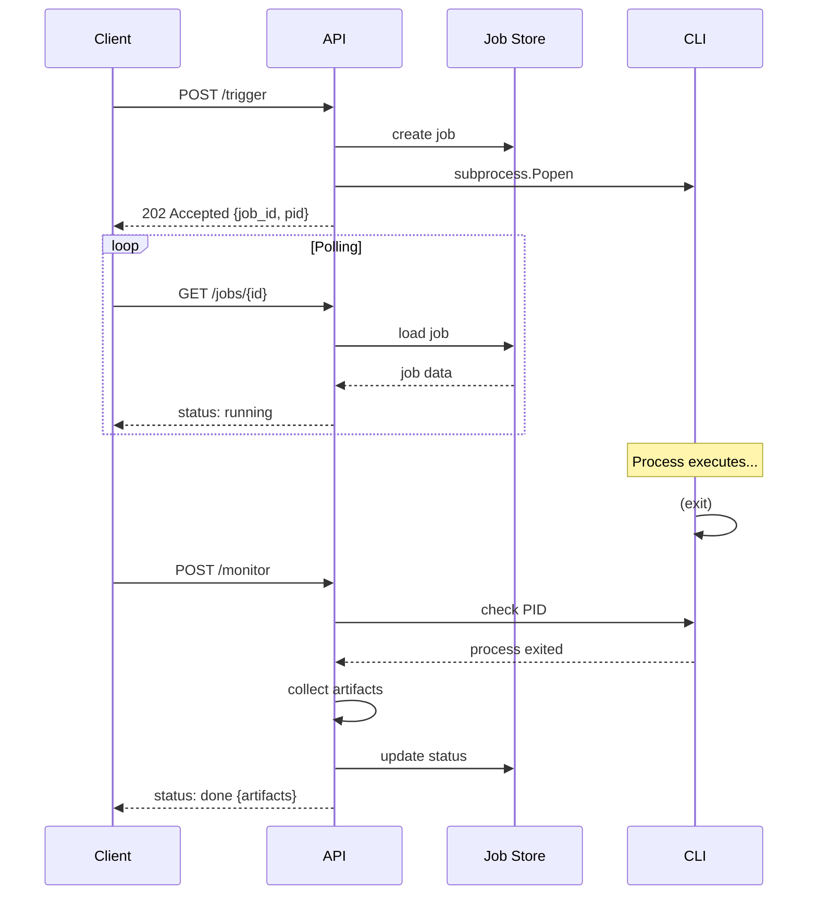
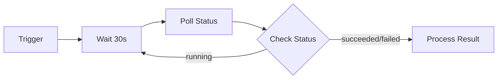

# Trigger-based API Layer

## 개요 (Overview)

Trigger API는 비동기 작업 실행을 위한 API 레이어입니다. CLI를 진실의 근원(source of truth)으로 유지하면서, API는 subprocess를 통해 CLI 명령을 실행합니다.

### 핵심 원칙
- **CLI = Source of Truth**: 모든 핵심 로직은 CLI에 존재
- **Non-blocking**: API는 작업을 트리거하고 즉시 반환
- **파일 기반 저장소**: jobs/ 디렉토리에 JSON 파일로 저장
- **PID 추적**: 프로세스 모니터링을 위한 PID 기록

## 인증 (Authentication)

API 인증은 기본적으로 **비활성화**되어 있습니다. 환경 변수로 활성화할 수 있습니다.

```bash
# .env
API_AUTH_ENABLED=true
API_KEY=your-secure-api-key
```

인증이 활성화된 경우, 모든 요청에 `X-API-Key` 헤더가 필요합니다:

```bash
curl -X POST http://localhost:8000/jobs/story/trigger \
  -H "Content-Type: application/json" \
  -H "X-API-Key: your-secure-api-key" \
  -d '{"max_stories": 1}'
```

**인증 제외**: `/health`, `/resource/status` 엔드포인트는 인증 없이 접근 가능합니다.

## 엔드포인트 (Endpoints)

### Job Trigger 엔드포인트

| Method | Path | 설명 |
|--------|------|------|
| POST | /jobs/story/trigger | 스토리 생성 작업 트리거 |
| POST | /jobs/research/trigger | 리서치 생성 작업 트리거 |

### Job 관리 엔드포인트

| Method | Path | 설명 |
|--------|------|------|
| GET | /jobs/{job_id} | 단일 작업 상태 조회 |
| GET | /jobs | 전체 작업 목록 조회 (필터링 지원) |
| POST | /jobs/{job_id}/cancel | 실행 중인 작업 취소 (SIGTERM) |
| POST | /jobs/monitor | 모든 실행 중 작업 모니터링 |
| POST | /jobs/{job_id}/monitor | 단일 작업 모니터링 |
| POST | /jobs/{job_id}/dedup_check | 리서치 작업 중복 검사 (canonical) |

### Research 엔드포인트

| Method | Path | 설명 |
|--------|------|------|
| POST | /research/run | 연구 생성 (동기) |
| POST | /research/validate | 연구 카드 검증 |
| GET | /research/list | 연구 카드 목록 |
| POST | /research/dedup | 시맨틱 중복 검사 (FAISS) |

## 시퀀스 다이어그램 (Sequence Diagram)



## Job 스키마 (Job Schema)

```json
{
  "job_id": "uuid4",
  "type": "story_generation | research",
  "status": "queued | running | succeeded | failed | cancelled",
  "params": { ... },
  "pid": 12345,
  "log_path": "logs/story_uuid.log",
  "artifacts": ["/path/to/output.json"],
  "created_at": "2026-01-11T12:00:00",
  "started_at": "2026-01-11T12:00:01",
  "finished_at": "2026-01-11T12:05:00",
  "exit_code": 0,
  "error": null
}
```

## 사용 예시 (Usage Examples)

### 스토리 생성 트리거

**Request Body Parameters:**

| 파라미터 | 타입 | 기본값 | 설명 |
|---------|------|--------|------|
| `max_stories` | int | 1 | 최대 스토리 생성 개수 (1-100) |
| `duration_seconds` | int | null | 실행 시간 제한 (초) |
| `interval_seconds` | int | 0 | 스토리 생성 간 대기 시간 (초) |
| `enable_dedup` | bool | false | 중복 검사 활성화 |
| `db_path` | string | null | 커스텀 DB 경로 |
| `load_history` | bool | false | 히스토리 로드 여부 |
| `model` | string | null | 모델 선택 (Claude/Ollama) |
| `target_length` | int | null | 목표 스토리 길이 (300-10000자, soft limit) |
| `webhook_url` | string | null | 완료 시 웹훅 URL |
| `webhook_events` | string[] | ["succeeded", "failed", "skipped"] | 웹훅 트리거 이벤트 |

```bash
# 작업 트리거
curl -X POST http://localhost:8000/jobs/story/trigger \
  -H "Content-Type: application/json" \
  -d '{
    "max_stories": 5,
    "enable_dedup": true,
    "interval_seconds": 30,
    "target_length": 2500
  }'

# 응답
{
  "job_id": "abc-123-def",
  "type": "story_generation",
  "status": "running",
  "message": "Story generation job started with PID 12345"
}
```

### 리서치 생성 트리거

```bash
curl -X POST http://localhost:8000/jobs/research/trigger \
  -H "Content-Type: application/json" \
  -d '{
    "topic": "Korean apartment horror",
    "tags": ["urban", "isolation"]
  }'
```

### 작업 상태 확인

```bash
# 단일 작업 조회
curl http://localhost:8000/jobs/abc-123-def

# 전체 목록 (필터링)
curl "http://localhost:8000/jobs?status=running&type=research"
```

### 작업 모니터링

```bash
# 모든 실행 중 작업 모니터링 (상태 업데이트)
curl -X POST http://localhost:8000/jobs/monitor

# 단일 작업 모니터링
curl -X POST http://localhost:8000/jobs/abc-123-def/monitor
```

### 작업 취소

```bash
curl -X POST http://localhost:8000/jobs/abc-123-def/cancel
```

### 중복 검사 (Canonical - 작업 기반)

```bash
curl -X POST http://localhost:8000/jobs/abc-123-def/dedup_check

# 응답
{
  "job_id": "abc-123-def",
  "has_artifact": true,
  "artifact_path": "/path/to/RC-001.json",
  "signal": "LOW",
  "similarity_score": 0.15
}
```

### 시맨틱 중복 검사 (FAISS - 연구 카드)

```bash
curl -X POST http://localhost:8000/research/dedup \
  -H "Content-Type: application/json" \
  -d '{"card_id": "RC-20260112-015248"}'

# 응답
{
  "card_id": "RC-20260112-015248",
  "signal": "HIGH",
  "similarity_score": 0.9019,
  "nearest_card_id": "RC-20260112-014153",
  "similar_cards": [
    {"card_id": "RC-20260112-014153", "similarity_score": 0.9019},
    {"card_id": "RC-20260112-015216", "similarity_score": 0.8934}
  ],
  "index_size": 19,
  "message": null
}
```

**참고:** 시맨틱 중복 검사는 `nomic-embed-text` 모델을 사용하여 768차원 임베딩 벡터로 유사도를 측정합니다.

## 에러 처리 (Error Handling)

### 작업 실패 감지

작업 실패는 다음 방법으로 감지됩니다:

1. **프로세스 종료 감지**: `os.kill(pid, 0)` 시그널로 프로세스 생존 확인
2. **로그 파일 분석**: Traceback, Error, Exception 등 에러 패턴 검색
3. **아티팩트 수집**: 작업 시작 이후 생성된 파일 자동 수집

### 에러 상태 코드

| 상태 | 설명 |
|------|------|
| succeeded | 프로세스 종료 + 에러 미발견 |
| failed | 프로세스 종료 + 로그에 에러 감지 |
| cancelled | 사용자에 의해 취소됨 (SIGTERM) |

### 에러 복구

실패한 작업은 다음과 같이 처리됩니다:

- 로그 파일에서 에러 메시지 추출 (마지막 500자)
- exit_code 기록 (가능한 경우)
- artifacts는 실패한 작업에서도 수집됨

## 미래 작업 (Future Work)

### Webhook 통합

```yaml
# 예정된 기능
webhooks:
  on_complete:
    url: "https://your-server.com/hook"
    events: ["succeeded", "failed"]
    payload:
      job_id: "{{job.job_id}}"
      status: "{{job.status}}"
      artifacts: "{{job.artifacts}}"
```

### n8n 통합

n8n 워크플로우와의 통합을 위한 권장 패턴:

1. **Trigger Node**: HTTP Request로 /jobs/*/trigger 호출
2. **Wait Node**: 지정된 간격으로 대기 (30초 권장)
3. **Poll Node**: GET /jobs/{job_id}로 상태 확인
4. **Branch Node**: status에 따른 분기 처리



### 배치 작업

향후 지원 예정:
- POST /jobs/batch/trigger - 여러 작업 동시 트리거
- GET /jobs/batch/{batch_id} - 배치 상태 조회

## 파일 구조 (File Structure)

```
horror-story-generator/
├── src/
│   ├── infra/
│   │   ├── job_manager.py    # 작업 CRUD 모듈
│   │   └── job_monitor.py    # PID 모니터링 모듈
│   └── api/
│       ├── main.py           # FastAPI 앱
│       ├── routers/
│       │   ├── jobs.py       # 작업 API 엔드포인트
│       │   └── research.py   # 연구 API 엔드포인트
│       └── schemas/
│           ├── jobs.py       # 작업 Pydantic 스키마
│           └── research.py   # 연구 Pydantic 스키마
├── jobs/                     # 작업 JSON 저장소
│   └── {job_id}.json
└── logs/                     # 작업 로그 파일
    ├── story_{job_id}.log
    └── research_{job_id}.log
```

## 관련 문서

- [../core/ARCHITECTURE.md](../core/ARCHITECTURE.md) - 시스템 아키텍처
- [RESEARCH_DEDUP_SETUP.md](RESEARCH_DEDUP_SETUP.md) - 연구 중복 검사 설정
