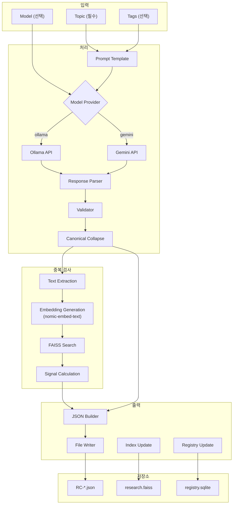
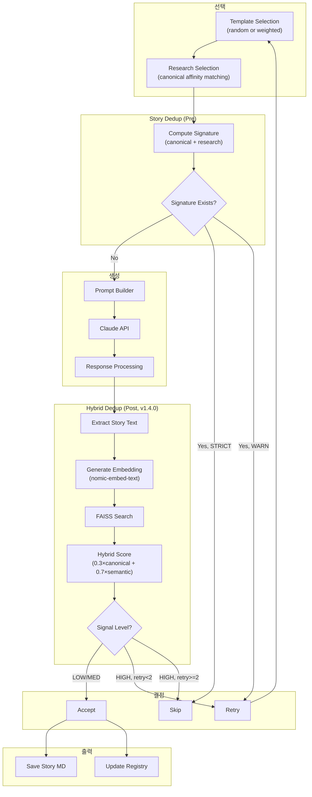
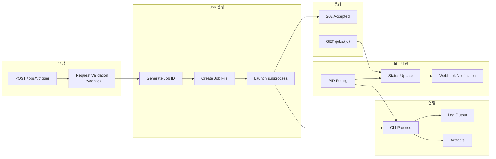
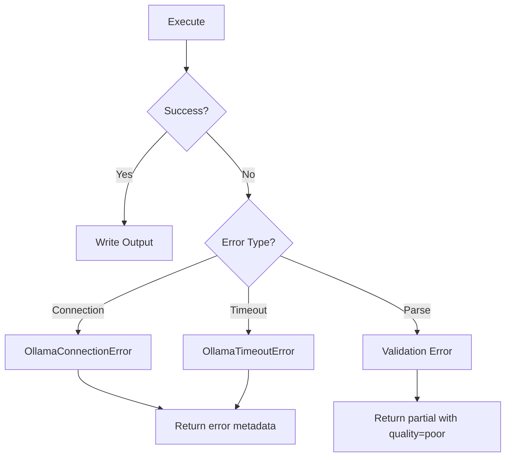
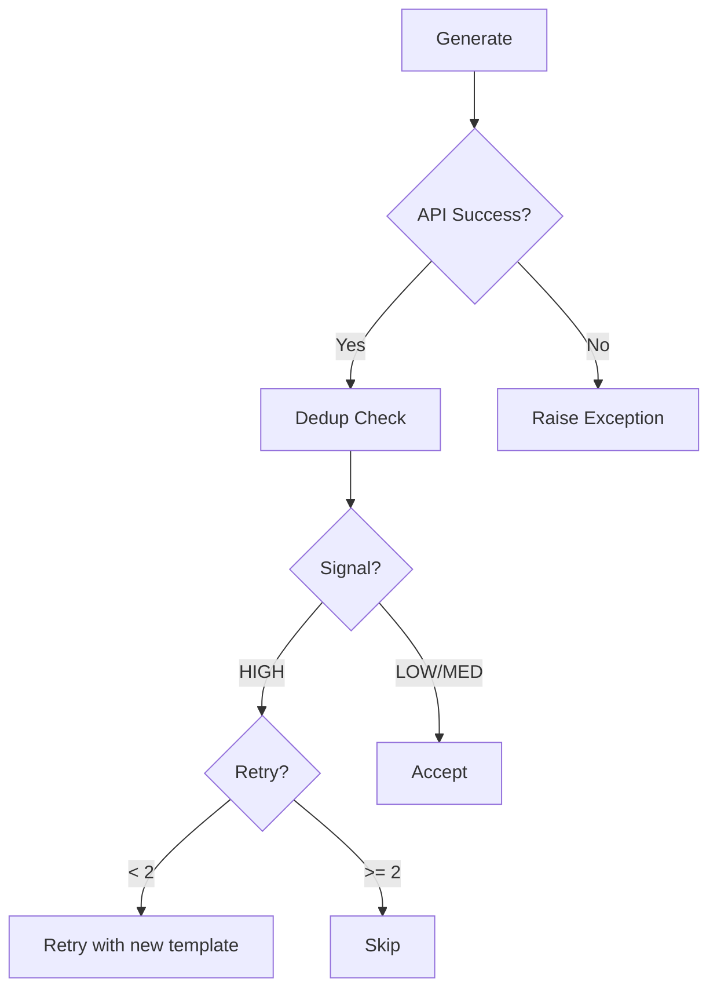

# End-to-End Dataflow

**Version:** 1.1
**Last Updated:** 2026-01-15

---

## Overview

이 문서는 Horror Story Generator의 데이터 흐름을 파이프라인별로 설명합니다.

---

## 1. Research Pipeline Dataflow

### 1.1 전체 흐름



### 1.2 단계별 설명

#### Step 1: Prompt Construction
- **입력:** topic, tags
- **처리:** `prompt_template.py`의 `build_prompt()` 호출
- **출력:** LLM용 프롬프트 문자열

#### Step 2: LLM Execution
- **모듈:** `model_provider.py`
- **Ollama:** HTTP POST to `localhost:11434/api/generate`
- **Gemini:** Google AI SDK `client.models.generate_content()`

#### Step 3: Response Validation
- **모듈:** `validator.py`
- **검증 항목:**
  - JSON 파싱 가능 여부
  - 필수 필드 존재 여부 (title, summary, key_concepts, horror_applications)
  - canonical_affinity 파싱 가능 여부
- **출력:** validation dict, quality_score

#### Step 4: Canonical Collapse
- **모듈:** `canonical_collapse.py`
- **입력:** `canonical_affinity` (다중값 배열)
- **출력:** `canonical_core` (단일값 객체)
- **규칙:** 우선순위 기반 선택 (primary_fear), 첫 번째 유효값 (기타)

#### Step 5: Dedup Check
- **모듈:** `src/dedup/research/`, `src/research/integration/vector_backend_hooks.py`
- **처리:**
  1. 카드 텍스트 추출 (topic, title, summary, concepts, applications)
  2. Ollama embedding 생성 (nomic-embed-text, 768차원)
  3. FAISS 인덱스에서 nearest neighbor 검색
  4. 유사도 점수 → 신호 레벨 변환
- **벡터 백엔드 (v1.4.0):** `vector_backend_hooks.py`에서 통합 벡터 연산 제공

#### Step 6: Output Writing
- **모듈:** `output_writer.py`
- **출력 파일:**
  - `data/research/YYYY/MM/RC-YYYYMMDD-HHMMSS.json`
  - (선택) `data/research/YYYY/MM/RC-YYYYMMDD-HHMMSS.md`

---

## 2. Story Pipeline Dataflow

### 2.1 전체 흐름



### 2.2 단계별 설명

#### Step 1: Template Selection
- **모듈:** `template_loader.py`
- **방식:**
  - 기본: 무작위 선택
  - Phase 3B: Registry 기반 가중치 선택 (최근 사용된 템플릿 회피)

#### Step 2: Research Selection
- **모듈:** `src/infra/research_context/selector.py`
- **알고리즘:**
  1. 사용 가능한 카드 로드 (HIGH dedup 제외)
  2. 템플릿 `canonical_core`와 각 카드의 `canonical_affinity` 매칭
  3. 가중 점수 계산
  4. 상위 K개 반환

#### Step 3: Story-Level Dedup (Pre-generation)
- **모듈:** `src/story/dedup/story_signature.py`
- **시그니처 계산:**
  ```python
  signature = SHA256(canonical_core + sorted(research_used))
  ```
- **정책:**
  - WARN (기본): 경고 후 다른 템플릿으로 재시도
  - STRICT: 즉시 중단

#### Step 4: Prompt Construction
- **모듈:** `prompt_builder.py`
- **구성:**
  - System prompt: 작문 지침 + 템플릿 구조 + 리서치 컨텍스트
  - User prompt: 생성 요청

#### Step 5: Claude API Call
- **모듈:** `api_client.py`
- **API:** Anthropic Messages API
- **모델:** 환경변수 `CLAUDE_MODEL` (기본: claude-sonnet-4-5)

#### Step 6: Hybrid Dedup (Post-generation, v1.4.0)
- **모듈:** `src/dedup/story/`, `src/story/dedup/story_dedup_check.py`
- **처리:**
  1. 스토리 텍스트 추출 (제목, 요약, 본문, canonical)
  2. Ollama embedding 생성 (nomic-embed-text, 768차원)
  3. Story FAISS 인덱스에서 nearest neighbor 검색
  4. 하이브리드 점수 계산: `hybrid = (canonical × 0.3) + (semantic × 0.7)`
  5. 복합 신호 레벨 결정

#### Step 7: Decision & Output
- **LOW/MEDIUM:** 수락 → 파일 저장 + Registry 등록
- **HIGH (retry < 2):** 다른 템플릿으로 재생성
- **HIGH (retry >= 2):** 스킵 (Registry에 기록)

---

## 3. API Pipeline Dataflow

### 3.1 전체 흐름



### 3.2 Job Lifecycle

```
queued → running → succeeded
                 ↘ failed
                 ↘ cancelled
```

---

## 4. Data Flow Summary

### 4.1 입력 → 출력 매핑

| 파이프라인 | 입력 | 출력 |
|------------|------|------|
| Research | topic, tags, model | `RC-*.json`, FAISS index |
| Story | template, research | `horror_story_*.md`, registry |
| API | HTTP request | job file, log, artifacts |

### 4.2 데이터 의존성

```
Research Cards (RC-*.json)
     ↓
FAISS Index (research.faiss)
     ↓
Research Selection (selector.py)
     ↓
Story Generation (generator.py)
     ↓
Story Hybrid Dedup (v1.4.0)
     ↓  ↘
Story FAISS Index (story.faiss)
     ↓
Story Registry (story_registry.db)
```

---

## 5. Error Handling Flow

### 5.1 Research Pipeline



### 5.2 Story Pipeline



---

## Version History

| 버전 | 날짜 | 변경 내용 |
|------|------|----------|
| 1.0 | 2026-01-14 | 초기 문서 작성 |
| 1.1 | 2026-01-15 | v1.4.0 스토리 하이브리드 시맨틱 dedup 반영 |
