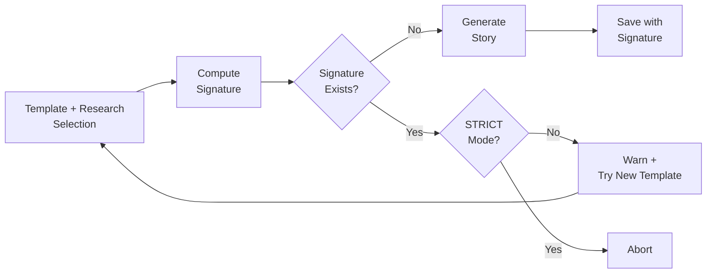

# 24-Hour Continuous Operation Test - Runbook

**Version:** 1.9.0 <!-- x-release-please-version -->
**Date:** 2026-01-13
**Phase:** Operational Verification (v1.3.2)

---

## Purpose

This runbook provides procedures to verify that the horror story generator can run continuously for 24 hours without:
- Data loss
- Silent failures
- Unreliable logging
- Inability to shutdown gracefully

---

## Prerequisites

### Environment Setup

1. **API Key:**
   ```bash
   # Ensure .env file exists with valid API key
   cat .env | grep ANTHROPIC_API_KEY
   ```

2. **Dependencies:**
   ```bash
   # Python 3.8+ required
   python --version

   # Install dependencies
   pip install -r requirements.txt
   ```

3. **Disk Space:**
   ```bash
   # Ensure sufficient space for logs and stories
   # Estimate: ~50KB per story, ~10KB per log entry
   # For 24h at 30min intervals: ~48 stories = ~3MB
   df -h .
   ```

4. **Dedup Configuration (선택):**
   ```bash
   # .env 파일에서 중복 검사 설정 확인
   cat .env | grep -E "(ENABLE_STORY_DEDUP|STORY_DEDUP_STRICT)"
   ```

   | 환경 변수 | 기본값 | 설명 |
   |-----------|--------|------|
   | `ENABLE_STORY_DEDUP` | `true` | 스토리 레벨 중복 검사 활성화 |
   | `STORY_DEDUP_STRICT` | `false` | true 시 중복 감지되면 생성 중단 |

5. **API Server Startup (if using API):**

   > **Note:** API server may fail on first startup due to port conflicts or missing ENV.
   > Solution: `pkill -f uvicorn` and retry, or verify `.env` is loaded.

6. **Registry Backup Verification:**
   ```bash
   # 기존 백업 파일 확인
   ls -la data/*.backup.*.db 2>/dev/null || echo "백업 파일 없음 (정상)"

   # 레지스트리 버전 확인
   sqlite3 data/story_registry.db "SELECT value FROM meta WHERE key='schema_version';"
   # 예상 출력: 1.1.0
   ```

   **백업 생성 조건:**
   - 스키마 버전 불일치 시 자동 생성
   - 정상 v1.1.0 운영 시 백업 생성 안함
   - 자세한 내용: [REGISTRY_BACKUP_GUIDE.md](REGISTRY_BACKUP_GUIDE.md)

---

## Story-Level Deduplication

### 개요

스토리 레벨 중복 검사는 **구조적으로 동일한 스토리**가 생성되는 것을 방지합니다:

- 동일한 `canonical_core` + `research_used` 조합 → 중복으로 판단
- SHA256 해시 기반 시그니처로 빠른 중복 검사
- 연구 카드 중복 검사와 **독립적으로** 동작

### 연구 레벨 vs 스토리 레벨 중복 검사

| 구분 | 연구 레벨 (FAISS) | 스토리 레벨 (Signature) |
|------|-------------------|------------------------|
| 대상 | 연구 카드 | 스토리 |
| 방식 | 시맨틱 임베딩 유사도 | 정확한 시그니처 매칭 |
| 트리거 | 연구 카드 생성 시 | 스토리 생성 전 |
| 목적 | 유사 연구 방지 | 구조적 중복 방지 |

### 동작 흐름



### 스토리 시그니처 계산

```
Story Signature = SHA256(canonical_core + research_used)
```

- `canonical_core`: 템플릿의 5차원 정규화 핑거프린트
- `research_used`: 주입된 연구 카드 ID 목록 (정렬됨)

### 모드별 동작

| 모드 | 중복 감지 시 | 환경 변수 |
|------|-------------|-----------|
| WARN (기본) | 경고 로그 후 다른 템플릿 시도 | `STORY_DEDUP_STRICT=false` |
| STRICT | 즉시 생성 중단 | `STORY_DEDUP_STRICT=true` |

---

## Test Scenarios

### Scenario 1: Short Verification Test (15 minutes)

**Purpose:** Verify all mechanisms work before long-running test

```bash
# Generate 3 stories at 5-minute intervals
python main.py --max-stories 3 --interval-seconds 300
```

**Expected outcome:**
- 3 stories generated
- Files saved in `data/novel/`
- Logs written to `logs/horror_story_YYYYMMDD_HHMMSS.log`
- Final statistics printed

**Verification:**
```bash
# Check story files
ls -lh data/novel/horror_story_*.md | tail -3

# Check log file
tail -50 logs/horror_story_*.log

# Verify token usage logged
grep "토큰 사용량" logs/horror_story_*.log
```

---

### Scenario 2: 24-Hour Continuous Operation

**Purpose:** Full Phase 1 operational verification

```bash
# Run for 24 hours with 30-minute intervals
# Expected: ~48 stories generated
nohup python main.py \
  --duration-seconds 86400 \
  --interval-seconds 1800 \
  > output_24h.log 2>&1 &

# Save process ID
echo $! > generator.pid
```

**Monitor during operation:**

```bash
# Check process is running
ps -p $(cat generator.pid)

# Monitor real-time logs (stdout + stderr)
tail -f output_24h.log

# Monitor file logs
tail -f logs/horror_story_*.log

# Check stories generated so far
ls data/novel/ | wc -l

# Check disk usage
du -sh data/novel/ logs/
```

**After 24 hours:**

```bash
# Verify process completed
ps -p $(cat generator.pid) || echo "Process completed"

# Check final statistics
tail -20 output_24h.log

# Count generated stories
ls data/novel/horror_story_*.md | wc -l

# Verify all have metadata
ls data/novel/horror_story_*_metadata.json | wc -l
```

---

### Scenario 3: Graceful Shutdown Test

**Purpose:** Verify SIGINT/SIGTERM handling

```bash
# Start long-running operation
python main.py --max-stories 100 --interval-seconds 60 &
PID=$!

# Wait for first story to complete
sleep 120

# Send SIGINT (Ctrl+C equivalent)
kill -SIGINT $PID

# Verify graceful shutdown
wait $PID
echo "Exit code: $?"
```

**Expected behavior:**
1. Current story generation completes
2. Results saved
3. Final statistics logged
4. Process exits with code 0

**Verification:**
```bash
# Check last log entries
tail -30 logs/horror_story_*.log

# Verify final story is complete (not truncated)
tail -20 data/novel/horror_story_*.md | head -10

# Verify metadata saved
cat data/novel/horror_story_*_metadata.json | jq .
```

---

### Scenario 4: Usage Logging Resilience Test

**Purpose:** Verify system handles missing token usage gracefully

**Note:** This test cannot be directly triggered without API mocking. During normal operation, if API returns no usage data, verify:

```bash
# Search for warning messages
grep "토큰 사용량 정보 없음" logs/horror_story_*.log
grep "토큰 사용량 추출 실패" logs/horror_story_*.log

# Verify process did NOT crash
# Check for complete execution logs
grep "실행 완료 - 최종 통계" logs/horror_story_*.log
```

---

### Scenario 5: Story-Level Dedup Test

**Purpose:** Verify story-level dedup prevents duplicate generation

**Setup:**
```bash
# 1. STRICT 모드 비활성화 (기본값)
export STORY_DEDUP_STRICT=false

# 2. 첫 번째 스토리 생성 (중복 검사 활성화)
python main.py --max-stories 1 --enable-dedup
```

**Verification:**
```bash
# 스토리 메타데이터에서 시그니처 확인
cat data/novel/horror_story_*_metadata.json | jq '{story_signature, story_dedup_result}'

# 예상 결과:
# {
#   "story_signature": "abc123...",
#   "story_dedup_result": "unique"
# }
```

**Duplicate Detection Test:**
```bash
# 동일 템플릿 + 연구로 재생성 시도 (강제)
# 정상 동작: 다른 템플릿 선택 또는 경고 후 건너뜀

# 로그에서 중복 감지 확인
grep "story_dedup" logs/horror_story_*.log
grep "duplicate detected" logs/horror_story_*.log
```

**STRICT 모드 테스트:**
```bash
# STRICT 모드 활성화
export STORY_DEDUP_STRICT=true

# 중복 시도 시 즉시 중단되어야 함
python main.py --max-stories 1 --enable-dedup

# 예상: 중복 감지 시 ValueError 발생 후 종료
```

---

## Stop Conditions

The generator stops when ANY of the following occurs:

1. **Duration limit reached** (`--duration-seconds`)
   ```
   실행 시간 제한 도달 (86400.0초) - 루프 종료
   ```

2. **Story count limit reached** (`--max-stories`)
   ```
   생성 개수 제한 도달 (10개) - 루프 종료
   ```

3. **SIGINT received** (Ctrl+C)
   ```
   SIGINT 수신 - 현재 작업 완료 후 종료합니다
   ```

4. **SIGTERM received** (system shutdown)
   ```
   SIGTERM 수신 - 현재 작업 완료 후 종료합니다
   ```

---

## Success Criteria

Phase 1 passes if ALL of the following are verified:

### 1. Background Execution ✓
- [ ] Process runs unattended for full duration
- [ ] No interactive prompts or hangs
- [ ] Process continues after terminal disconnect (nohup)

### 2. Real-time Observability ✓
- [ ] Logs visible in stdout
- [ ] Logs persisted to `logs/horror_story_YYYYMMDD_HHMMSS.log`
- [ ] Log entries timestamped
- [ ] Log file readable during execution

### 3. Output Continuity ✓
- [ ] All stories successfully generated
- [ ] Each story has corresponding `.md` file
- [ ] Each story has corresponding `_metadata.json` file
- [ ] No partial or truncated outputs
- [ ] Markdown files have valid YAML frontmatter

### 4. Graceful Shutdown ✓
- [ ] SIGINT handled correctly
- [ ] SIGTERM handled correctly
- [ ] Current generation completes before exit
- [ ] Output saved
- [ ] Final statistics logged
- [ ] Process exits cleanly (exit code 0)
- [ ] No interrupted iterations (check last story is complete)

### 5. Usage Logging Reliability ✓
- [ ] Token usage logged for each generation
- [ ] Input/output/total tokens all present
- [ ] Final statistics show cumulative token usage
- [ ] If usage missing: warning logged (NOT crash)
- [ ] If usage missing: `usage: null` in metadata
- [ ] Average tokens/story calculated correctly

### 6. Story-Level Deduplication ✓
- [ ] Story signature computed for each generated story
- [ ] Metadata includes `story_signature` field (64 char hex)
- [ ] Metadata includes `story_dedup_result` field (unique/duplicate)
- [ ] Duplicate detected → alternative template selected or skipped
- [ ] STRICT mode: duplicate → process aborts (if enabled)
- [ ] Registry stores signature for future lookups

---

## Troubleshooting

### Problem: Process exits immediately

```bash
# Check for errors
tail -50 logs/horror_story_*.log

# Common causes:
# - Missing ANTHROPIC_API_KEY
# - Invalid API key
# - Missing dependencies
```

**Solution:**
```bash
# Verify API key
python -c "from dotenv import load_dotenv; import os; load_dotenv(); print(os.getenv('ANTHROPIC_API_KEY'))"

# Test single generation first
python main.py --max-stories 1
```

---

### Problem: Logs not updating

```bash
# Check if process is running
ps aux | grep "python main.py"

# Check if log file is being written
ls -lh logs/

# Check stdout/stderr
tail -f output_24h.log
```

**Solution:**
- Verify process PID matches
- Check disk space (`df -h`)
- Check file permissions (`ls -la logs/`)

---

### Problem: Shutdown takes too long

**Expected behavior:**
- Shutdown initiated immediately
- Current generation completes (may take 30-120 seconds)
- Final statistics logged
- Exit

**If hanging:**
```bash
# Send SIGTERM after SIGINT
kill -SIGTERM $(cat generator.pid)

# Force kill only as last resort (loses current generation)
kill -9 $(cat generator.pid)
```

---

### Problem: Token usage shows 0 or null

**Check logs:**
```bash
grep -A5 "토큰 사용량" logs/horror_story_*.log
```

**If warning present:**
```
⚠ 토큰 사용량 정보 없음
```

**This is expected behavior** if API doesn't return usage. Verify:
- [ ] Warning logged (not error)
- [ ] Process continues
- [ ] Story still saved
- [ ] Metadata has `"usage": null`

---

### Problem: Story dedup detecting too many duplicates

**Check logs:**
```bash
grep "story_dedup" logs/horror_story_*.log
grep "duplicate detected" logs/horror_story_*.log
```

**Common causes:**
- 템플릿 + 연구 조합이 이미 사용됨
- 연구 카드 풀이 너무 작음
- 템플릿 다양성 부족

**Solutions:**
```bash
# 1. 새 연구 카드 생성
python -m src.research.executor run "새로운 공포 주제" --tags horror new

# 2. 사용된 시그니처 확인
sqlite3 data/story_registry.db "SELECT story_signature, title FROM stories WHERE story_signature IS NOT NULL ORDER BY created_at DESC LIMIT 10"

# 3. STRICT 모드 비활성화 (더 유연한 동작)
export STORY_DEDUP_STRICT=false
```

---

### Problem: Story signature missing in metadata

**Check:**
```bash
cat data/novel/horror_story_*_metadata.json | jq 'select(.story_signature == null)'
```

**Possible causes:**
- `ENABLE_STORY_DEDUP=false` 설정됨
- 스토리 레지스트리 초기화 안됨

**Solution:**
```bash
# 환경 변수 확인
cat .env | grep ENABLE_STORY_DEDUP

# 레지스트리 스키마 확인
sqlite3 data/story_registry.db ".schema stories" | grep story_signature
```

---

## Verification Checklist

After completing 24h test, verify all criteria:

```bash
# 1. Background execution
ps -p $(cat generator.pid) && echo "FAIL: Still running" || echo "PASS: Completed"

# 2. Observability
ls logs/horror_story_*.log && echo "PASS: Log file exists"
wc -l logs/horror_story_*.log  # Should have many lines

# 3. Output continuity
STORY_COUNT=$(ls data/novel/horror_story_*.md 2>/dev/null | wc -l)
METADATA_COUNT=$(ls data/novel/horror_story_*_metadata.json 2>/dev/null | wc -l)
echo "Stories: $STORY_COUNT, Metadata: $METADATA_COUNT"
[ "$STORY_COUNT" -eq "$METADATA_COUNT" ] && echo "PASS: Output complete"

# 4. Graceful shutdown
grep "실행 완료 - 최종 통계" logs/horror_story_*.log && echo "PASS: Graceful exit"

# 5. Usage logging
grep "총 토큰 사용량" logs/horror_story_*.log && echo "PASS: Usage logged"

# 6. Story dedup
SIG_COUNT=$(cat data/novel/horror_story_*_metadata.json 2>/dev/null | jq -r '.story_signature // empty' | wc -l)
echo "Stories with signature: $SIG_COUNT"
[ "$SIG_COUNT" -eq "$STORY_COUNT" ] && echo "PASS: All stories have signatures"
```

---

## CLI Reference

```
usage: main.py [-h] [--duration-seconds DURATION_SECONDS]
               [--max-stories MAX_STORIES]
               [--interval-seconds INTERVAL_SECONDS]
               [--enable-dedup] [--db-path DB_PATH]
               [--model MODEL]

optional arguments:
  -h, --help            show this help message and exit
  --duration-seconds DURATION_SECONDS
                        실행 지속 시간(초). 지정하지 않으면 --max-stories 또는
                        수동 종료까지 실행
  --max-stories MAX_STORIES
                        생성할 최대 소설 개수. 기본값=1 (단일 실행)
  --interval-seconds INTERVAL_SECONDS
                        소설 생성 간 대기 시간(초). 기본값=0 (대기 없음)
  --enable-dedup        중복 검사 활성화 (canonical + story-level)
  --db-path DB_PATH     SQLite DB 경로. 기본값=data/story_registry.db
  --model MODEL         모델 선택. 기본=Claude Sonnet. 형식: 'ollama:llama3', 'ollama:qwen'
```

**Environment Variables:**

| 변수 | 기본값 | 설명 |
|------|--------|------|
| `ENABLE_STORY_DEDUP` | `true` | 스토리 레벨 중복 검사 활성화 |
| `STORY_DEDUP_STRICT` | `false` | true 시 중복 감지 즉시 중단 |
| `OLLAMA_HOST` | `localhost` | Ollama 서버 호스트 |
| `OLLAMA_PORT` | `11434` | Ollama 서버 포트 |
| `GEMINI_ENABLED` | `false` | Gemini API 활성화 (연구 생성용) |
| `GEMINI_API_KEY` | - | Gemini API 키 |
| `GOOGLE_AI_MODEL` | `deep-research-pro-preview-12-2025` | 기본 Google AI 모델 |

**Examples:**

```bash
# Single generation (default Claude, backward compatible)
python main.py

# Generate 5 stories immediately
python main.py --max-stories 5

# Generate with local Ollama model
python main.py --model ollama:llama3
python main.py --model ollama:qwen

# Run for 1 hour, 15min intervals (with dedup)
python main.py --duration-seconds 3600 --interval-seconds 900 --enable-dedup

# Run for 24 hours, 30min intervals (with dedup)
python main.py --duration-seconds 86400 --interval-seconds 1800 --enable-dedup

# 24h with Ollama local model
python main.py --duration-seconds 86400 --interval-seconds 1800 --enable-dedup --model ollama:llama3

# Infinite mode with strict dedup (stop with Ctrl+C)
STORY_DEDUP_STRICT=true python main.py --max-stories 999999 --interval-seconds 600 --enable-dedup
```

**Research CLI Examples:**

```bash
# 연구 카드 생성 (기본 Ollama)
python -m src.research.executor run "한국 공포 문화" --tags horror korean

# Gemini Deep Research Agent로 연구 (권장)
# API: Google AI Studio, 모델: deep-research-pro-preview-12-2025
python -m src.research.executor run "한국 공포 문화" --model deep-research

# 표준 Gemini API로 연구
python -m src.research.executor run "한국 공포 문화" --model gemini
```

---

## Post-Test Analysis

After successful 24h run:

```bash
# Generate summary report
echo "=== 24H TEST SUMMARY ===" > test_summary.txt
echo "Test completed: $(date)" >> test_summary.txt
echo "" >> test_summary.txt

# Story count
echo "Stories generated: $(ls data/novel/horror_story_*.md | wc -l)" >> test_summary.txt

# Total size
echo "Total story size: $(du -sh data/novel/ | cut -f1)" >> test_summary.txt
echo "Total log size: $(du -sh logs/ | cut -f1)" >> test_summary.txt

# Extract final stats from log
echo "" >> test_summary.txt
echo "=== FINAL STATISTICS ===" >> test_summary.txt
tail -20 logs/horror_story_*.log >> test_summary.txt

cat test_summary.txt
```

---

## Notes

- **Backward compatibility:** Running `python main.py` with no arguments still generates a single story (default: `--max-stories 1`)
- **Graceful degradation:** If token usage is unavailable, process continues with warning
- **Log file persistence:** One log file per process execution (filename includes start timestamp)
- **No interruption during generation:** SIGINT/SIGTERM only stop after current story completes
- **Story-level dedup:** 스토리 시그니처 기반 중복 검사로 구조적 중복 방지 (STEP 4-C)
- **Two-layer dedup:** 연구 레벨 (FAISS 시맨틱) + 스토리 레벨 (시그니처 해시) 이중 보호

---

## Next Steps (Out of Scope for Phase 1)

Phase 1 verification ends here. The following are explicitly NOT implemented:

- ✅ KU / Canonical integration (STEP 4-C에서 구현됨)
- ✅ Story-level dedup (STEP 4-C에서 구현됨)
- ✅ Database persistence (SQLite 레지스트리)
- ❌ Story validation (향후 구현)
- ❌ Platform upload
- ❌ Distributed execution

Phase 2 will address remaining items if requirements specify them.
